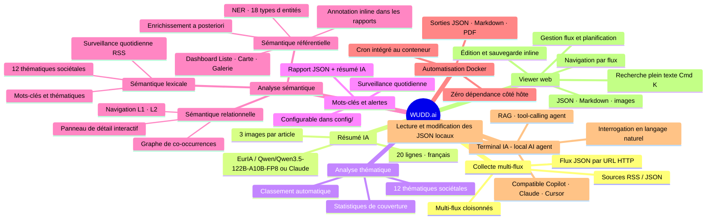

# WUDD.ai

<p align="left">
    
</p>

<p align="left">
  <a href="https://github.com/pat-the-geek/WUDD.ai/actions">
    
  </a>
  <a href="https://github.com/pat-the-geek/WUDD.ai/blob/main/LICENSE">
    
  </a>
  <a href="https://www.python.org/downloads/release/python-3100/">
    
  </a>
  <a href="https://github.com/pat-the-geek/WUDD.ai/commits/main">
    
  </a>
  <a href="https://github.com/pat-the-geek/WUDD.ai/issues">
    
  </a>
</p>

> **What's up, Doc?** — Plateforme de veille intelligente inspirée de Bugs Bunny : collecte, analyse et synthèse d'actualités via l'API EurIA (Infomaniak / Qwen/Qwen3.5-122B-A10B-FP8) ou Claude (Anthropic), à partir de flux JSON accessibles par URL HTTP.

---

## Table des matières

1. [Présentation](#1-présentation)
2. [Architecture](#2-architecture)
3. [Installation](#3-installation)
4. [Utilisation](#4-utilisation)
5. [Viewer — Interface de visualisation](#5-viewer--interface-de-visualisation)
6. [Configuration des flux](#6-configuration-des-flux)
7. [Fonctionnement technique](#7-fonctionnement-technique)
8. [Orchestration Docker](#8-orchestration-docker)
9. [Développement et extension](#9-développement-et-extension)
10. [Limitations](#10-limitations)
11. [FAQ / Dépannage](#11-faq--dépannage)
12. [Contribuer](#12-contribuer)
13. [Contact et licence](#13-contact-et-licence)

> 📖 Use cases illustrés : [docs/USE_CASES.md](docs/USE_CASES.md) — 18 scénarios avec diagrammes Mermaid, dont le UC18 : Génération assistée de champs sémantiques.

---

## 1. Présentation

# WUDD.ai — Plateforme de veille de presse intelligente

WUDD.ai est une plateforme open-source de **veille de presse automatisée**.  
Elle collecte des articles depuis des flux JSON et RSS, les enrichit via une API IA  
(Infomaniak EurIA / Qwen/Qwen3.5-122B-A10B-FP8 ou Claude), et les rend exploitables via une interface web locale.

## Ce que fait WUDD.ai

- **Pipeline de résumé automatique** — chaque article est résumé en 20 lignes par l'IA,
  classé par thématique et exporté en JSON, Markdown ou PDF
- **Enrichissement sémantique** — extraction d'entités nommées (NER : personnes, orgs,
  lieux, produits…), analyse de sentiment et ton éditorial
- **Terminal IA avec RAG explicite** — interface de chat qui injecte dans le contexte du
  modèle les fichiers d'articles sélectionnés, les notes personnelles de lecture et une
  recherche web temps réel (EurIA)
- **Orchestration complète** — pipeline cron Docker : collecte, enrichissement nocturne,
  digests quotidiens, briefings hebdomadaires, rapports mensuels
- **Tableau de bord entités** — statistiques agrégées cross-flux, graphe de co-occurrence,
  synthèse IA par entité (streaming SSE)

## Stack technique

### Langage & Runtime

| Technologie | Version | Description |
|---|---|---|
| Python | 3.10+ | Langage principal — scripts, utils, backend Flask |

### IA & API externes

| Technologie | Description |
|---|---|
| EurIA / Qwen/Qwen3.5-122B-A10B-FP8 (Infomaniak) | Provider IA par défaut — résumés, NER, sentiments, rapports via API REST |
| Claude (Anthropic) | Provider IA alternatif — sélectionnable via `AI_PROVIDER=claude` dans `.env` |
| Ollama (local) | Provider NER/sentiment batch local (Option A : `AI_PROVIDER_NER=ollama`) et résumés d'articles (Option B : `AI_PROVIDER_SUMMARY=ollama`) — aucun token consommé, Metal/Neural Engine sur Apple Silicon |

### HTTP & Parsing web

| Technologie | Description |
|---|---|
| `requests` | Bibliothèque HTTP principale — appels API et récupération de flux |
| `urllib3` | Couche basse HTTP — retry adapter avec backoff exponentiel (2.0×) |
| `beautifulsoup4` | Parsing HTML — extraction `og:image`, `twitter:image`, texte brut |

### Configuration & Secrets

| Technologie | Description |
|---|---|
| `python-dotenv` | Chargement des variables d'environnement depuis `.env` |
| JSON (`config/`) | Fichiers de configuration : flux, quotas, sources, alertes, crédibilité |

### Stockage des données

| Technologie | Description |
|---|---|
| Fichiers JSON | Source de vérité — articles, quotas, alertes, timelines (aucune base de données) |
| DuckDB ≥ 0.10.0 | Couche analytique en mémoire — requêtes SQL sur JSON natifs via `read_json_auto()`. Optionnel (`utils/db.py`) |
| Cache fichier MD5/TTL | Cache API 24h basé sur hachage MD5 des clés (`utils/cache.py`) |
| Fichiers Markdown / PDF | Format de sortie des rapports et notes de lecture |

### Tests & Qualité

| Technologie | Description |
|---|---|
| `pytest` | Framework de tests — 50+ tests unitaires et d'intégration |
| `pytest-cov` | Mesure de couverture de code (cible ≥ 80% sur `utils/`) |

### Conteneurisation & Orchestration

| Technologie | Description |
|---|---|
| Docker | Image de conteneur — environnement reproductible pour la production |
| Docker Compose | Orchestration multi-service (app + cron) |
| `cron` | Planificateur de tâches inside Docker — pipeline nocturne et watcheurs continus |

### Backend Web (Viewer)

| Technologie | Description |
|---|---|
| Flask | Serveur backend Python — API REST (lecture/écriture fichiers, exécution scripts, streaming SSE) |
| SSE (Server-Sent Events) | Streaming temps réel des logs de scripts vers le frontend |

### Frontend Web (Viewer)

| Technologie | Description |
|---|---|
| React 18 | Framework UI — composants dynamiques pour le viewer local |
| Vite | Bundler/dev server — compilation vers `viewer/dist/` pour la production |
| Tailwind CSS | Framework CSS utilitaire — responsive design mobile/tablet/desktop |
| Leaflet | Cartographie interactive — visualisation des entités géographiques (GPE/LOC) |

### Formats d'export

| Technologie | Description |
|---|---|
| Atom XML | Flux de syndication (`utils/exporters/atom_feed.py`) |
| HTML + SMTP | Newsletters générées et envoyées par email (`utils/exporters/newsletter.py`) |
| Webhook | Notifications Discord, Slack, Ntfy (`utils/exporters/webhook.py`) |

## Cas d'usage

Journalistes, chercheurs, équipes de communication ou toute personne souhaitant suivre
un domaine d'actualité sans dépendre d'un service tiers payant.


Un exemple de rapport est disponible dans : [`samples/rapport_sommaire_articles_generated_2026-02-01_2026-02-28.md`](samples/rapport_sommaire_articles_generated_2026-02-01_2026-02-28.md)

### Trois niveaux d'analyse sémantique

WUDD.ai analyse l'information selon trois couches sémantiques complémentaires :

**1. La sémantique lexicale — les mots-clés**
Associer un texte à des mots-clés, c'est identifier de quoi il parle — son sujet, son domaine, son champ thématique. C'est la couche la plus basique du sens. WUDD.ai l'implémente via la surveillance quotidienne de 133+ sources RSS par mots-clés configurables, et la classification thématique des articles en 12 thématiques sociétales.

**2. La sémantique référentielle — les entités**
Reconnaître qu'un mot désigne une personne, un lieu, une organisation, un produit… c'est aller plus loin : on ne cherche plus seulement le thème mais les acteurs du réel que le texte convoque. C'est ce qu'on appelle la reconnaissance d'entités nommées (NER — Named Entity Recognition). WUDD.ai l'implémente via l'extraction automatique de 18 types d'entités (PERSON, ORG, GPE, PRODUCT, EVENT, DATE…) par l'API EurIA ou Claude, visualisées dans le Dashboard Entités avec carte géographique et galerie d'images.

**3. La sémantique relationnelle — le liant**
Ce qui rend le système vraiment sémantique, c'est quand il commence à percevoir les relations entre entités : qui fait quoi, qui est lié à qui, quelle entité est associée à quel événement. C'est là que le sens devient structuré comme une connaissance. WUDD.ai l'implémente à deux niveaux :

- **Graphe de co-occurrences par entité** (L1 et L2) — accessible depuis le panneau de détail de chaque entité, pour une navigation relationnelle continue dans le réseau sémantique du corpus.
- **Graphe de connaissances global** — vue d'ensemble de style Obsidian (force-directed canvas) qui positionne simultanément tous les articles et toutes les entités du corpus, avec leurs liaisons. Chargement en streaming SSE, légende interactive (clic pour masquer/afficher un type d'entité), contrôle de la longueur des liens (slider + calcul automatique selon la densité du graphe), zoom/pan, plein écran.

> Documentation complète : [docs/ENTITIES.md](docs/ENTITIES.md) — pipeline NER, Dashboard Liste / Carte / Galerie / Graphe, panneau de détail, caches.

Cette analyse sémantique ne reste pas confinée au Dashboard : elle est **injectée directement dans les rapports Markdown générés**. Chaque mention d'entité est annotée inline dans le corps des résumés (`**OpenAI** [org.]`, `**Sam Altman** [pers.]`, `**2030** [date]`…) et un bloc structuré récapitule les entités de l'article par catégorie. Les rapports deviennent ainsi des documents sémantiquement enrichis, lisibles à la fois par un humain et exploitables par un traitement automatique ultérieur.



---

## 2. Architecture

> 📐 Documentation technique complète : [docs/ARCHITECTURE.md](docs/ARCHITECTURE.md) — diagrammes Mermaid, flux de données, modèle de données, ADRs, roadmap.
>
> 🎯 Scénarios d'utilisation : [docs/USE_CASES.md](docs/USE_CASES.md) — 6 use cases illustrés avec diagrammes Mermaid (veille, rapports, entités, carte, graphe sémantique, rapport Claude).

### Pipeline de traitement

```
Flux JSON (HTTP) → Extraction HTML → Résumé IA (EurIA/Qwen/Qwen3.5-122B-A10B-FP8 ou Claude) → JSON → Enrichissement NER → Markdown annoté / PDF
```

### Arborescence du projet

```
WUDD.ai/
├── scripts/           # Scripts Python exécutables
│   ├── Get_data_from_JSONFile_AskSummary_v2.py  # Collecte + résumés IA
│   ├── Get_htmlText_From_JSONFile.py             # Extraction texte HTML
│   ├── articles_json_to_markdown.py              # Conversion JSON → Markdown
│   ├── analyse_thematiques.py                    # Analyse sociétale
│   ├── scheduler_articles.py                     # Scheduler multi-flux
│   ├── get-keyword-from-rss.py                   # Extraction par mot-clé
│   ├── enrich_entities.py                        # Enrichissement NER (entités nommées)
│   ├── import_articles.py                        # Import d'articles depuis un fichier JSON externe
│   └── check_cron_health.py                      # Monitoring cron
├── config/            # Sources, catégories, prompts, thématiques
├── data/              # Articles JSON générés (par flux)
│   ├── articles/<flux>/
│   ├── articles/cache/<flux>/
│   └── raw/
├── rapports/          # Rapports générés
│   ├── markdown/<flux>/
│   └── pdf/
├── viewer/            # Interface web de visualisation (Flask + React)
│   ├── app.py         # Backend Flask (API + serving)
│   └── src/           # Frontend React (Vite)
├── archives/          # Sauvegardes versionnées de scripts
├── samples/           # Exemples de rapports produits
├── tests/             # Tests unitaires
├── .github/           # Config GitHub Actions / Copilot
├── .env               # Variables d'environnement (non versionné)
└── README.md
```

### Fichiers de configuration clés

| Fichier | Rôle |
|---|---|
| `config/flux_json_sources.json` | Liste des flux RSS/JSON et paramètres cron |
| `config/sites_actualite.json` | Sources RSS disponibles |
| `config/categories_actualite.json` | Catégories d'articles |
| `config/keyword-to-search.json` | Mots-clés pour extraction quotidienne (avec filtres OR/AND et génération de champ sémantique IA) |
| `config/thematiques_societales.json` | 12 thématiques sociétales |
| `config/prompt-rapport.txt` | Template de prompt pour rapports |

---

## 3. Installation

### Prérequis

- Python 3.10+
- Compte Infomaniak avec accès à l'API EurIA **et/ou** clé API Claude (Anthropic) — au moins l'une des deux est requise
- *(Optionnel)* [Ollama](https://ollama.com) installé localement pour décharger le NER/sentiment batch sur GPU/NPU local (Apple Silicon recommandé)
- Docker (pour l'orchestration automatisée)

### Dépendances

```bash
pip install -r requirements.txt
```

### Configuration

#### 1. Variables d'environnement

Créez un fichier `.env` à la racine à partir du template fourni :

```bash
cp .env.example .env
# Éditez .env et renseignez vos vraies valeurs
```

Le fichier `.env` n'est jamais commité (`.gitignore`). Référez-vous à `.env.example` pour la liste complète des variables requises.

| Variable clé | Description |
|---|---|
| `URL` | Endpoint API EurIA |
| `bearer` | Token Bearer EurIA |
| `REEDER_JSON_URL` | URL du flux JSON source |
| `AI_PROVIDER` | Provider IA principal : `euria` (défaut), `claude`, `ollama` |
| `AI_PROVIDER_NER` | Provider dédié NER/sentiment batch : `ollama` pour l'inférence locale, vide = idem `AI_PROVIDER` |
| `AI_PROVIDER_SUMMARY` | Provider dédié aux résumés d'articles : `ollama` pour l'inférence locale, vide = idem `AI_PROVIDER` |
| `OLLAMA_MODEL` | Modèle Ollama à utiliser (défaut : `qwen2.5:7b`) |
| `OLLAMA_HOST_LOCAL` | Hôte Ollama pour l'exécution locale sur le Mac (recommandé : `localhost`) |
| `OLLAMA_HOST_DOCKER` | Hôte Ollama utilisé dans le conteneur Docker (recommandé : `host.docker.internal` sur macOS) |
| `OBSIDIAN_DIR` | Chemin absolu vers le vault Obsidian (export de notes, optionnel) |
| `BACKUP_L1` / `BACKUP_L2` | Chemins de sauvegarde incrémentale de `data/` |
| `MCP_HOST` / `MCP_PORT` | Hôte et port du serveur MCP (défaut : `0.0.0.0:8765`) |
| `MCP_TOKEN` | Token Bearer statique requis pour les clients MCP |
| `MCP_ENABLE_WRITE_TOOLS` | Active les écritures sûres (`annotations`, `watchlists`) du MCP |
| `MCP_VIEWER_BASE_URL` | URL interne du Viewer utilisée par le serveur MCP |

#### Configuration Ollama propre (macOS + Docker)

- Mettre `OLLAMA_HOST_LOCAL=localhost` dans `.env` pour toutes les exécutions lancées directement sur le Mac.
- Laisser `docker-compose.yml` injecter `OLLAMA_HOST_DOCKER=host.docker.internal` pour le conteneur.
- `OLLAMA_HOST` reste accepté pour compatibilité descendante, mais il n'est plus recommandé pour un projet exécuté à la fois sur l'hôte et dans Docker.

#### Maintenance Ollama rapide

- Vérifier la version : `ollama --version`
- Mettre à jour : `brew upgrade ollama`
- Redémarrer le LaunchAgent : `launchctl bootout gui/$(id -u) ~/Library/LaunchAgents/com.wudd.ollama.plist && launchctl bootstrap gui/$(id -u) ~/Library/LaunchAgents/com.wudd.ollama.plist`
- Vérifier l'API locale : `curl http://localhost:11434/api/tags`

#### 2. Fichier de flux `config/flux_json_sources.json`

> **⚠️ Ce fichier n'est pas dans le dépôt git** (il contient vos URLs de flux JSON).
> Seul le template `config/flux_json_sources.example.json` est versionné.

Créez votre fichier à partir de l'exemple :

```bash
cp config/flux_json_sources.example.json config/flux_json_sources.json
# Éditez config/flux_json_sources.json et renseignez vos URLs de flux
```

Voir la section [Configuration des flux](#6-configuration-des-flux) pour le format détaillé.

#### 3. Fichier de mots-clés `config/keyword-to-search.json`

> **⚠️ Ce fichier n'est pas dans le dépôt git** (contenu spécifique à chaque déploiement).
> Aucun template n'est fourni — il doit être créé manuellement.

Ce fichier est utilisé par `scripts/get-keyword-from-rss.py` (extraction quotidienne par mot-clé). Créez-le dans `config/` avec le format suivant :

```json
[
  { "keyword": "Intelligence artificielle" },
  { "keyword": "Trump" },
  { "keyword": "UBS", "and": ["banque", "bank"] },
  { "keyword": "David Bowie", "or": ["Ziggy Stardust", "Thin White Duke"] }
]
```

Sans ce fichier, le script `get-keyword-from-rss.py` s'arrête avec une erreur au démarrage. Voir la section [Filtrage avancé](#filtrage-avancé-or--and-dans-configkeyword-to-searchjson) pour la syntaxe complète des filtres `or` / `and`.

---

## 4. Utilisation

### Générer des résumés pour un flux

```bash
python3 scripts/Get_data_from_JSONFile_AskSummary_v2.py \
  --flux "Intelligence-artificielle" \
  --date_debut 2026-02-01 \
  --date_fin 2026-02-17
```

Sortie :
- `data/articles/Intelligence-artificielle/articles_generated_2026-02-01_2026-02-17.json`
- `rapports/markdown/Intelligence-artificielle/rapport_sommaire_*.md`

### Convertir un fichier JSON en rapport Markdown

```bash
python3 scripts/articles_json_to_markdown.py \
  data/articles/Intelligence-artificielle/articles_generated_2026-02-01_2026-02-17.json
```

### Lancer le scheduler multi-flux

```bash
python3 scripts/scheduler_articles.py
```

Traite automatiquement tous les flux définis dans `config/flux_json_sources.json`.

### Utiliser le serveur MCP

Le service `analyse-actualites-mcp` expose WUDD.ai en **MCP Streamable HTTP**
pour des clients distants sur le **LAN** ou via **Tailscale**.

- **Endpoint par défaut** : `http://<hote>:8765/mcp`
- **Authentification** : `Authorization: Bearer <MCP_TOKEN>`
- **Périmètre V1** :
  - lecture / analyse du corpus, des entités et des alertes
  - écritures sûres limitées aux **annotations** et aux **watchlists**

Variables à définir dans `.env` :

```env
MCP_HOST=0.0.0.0
MCP_PORT=8765
MCP_TOKEN=un-token-long-et-aleatoire
MCP_ENABLE_WRITE_TOOLS=true
MCP_VIEWER_BASE_URL=http://analyse-actualites-viewer:5050
MCP_REQUEST_TIMEOUT=10
MCP_HEAVY_REQUEST_TIMEOUT=30
```

`MCP_REQUEST_TIMEOUT` reste court pour les tools légers, tandis que
`MCP_HEAVY_REQUEST_TIMEOUT` couvre les appels plus coûteux comme
`get_entity_articles`, `get_entity_timeline` et `get_entity_cooccurrences`.

Démarrage via Docker Compose :

```bash
docker compose up -d analyse-actualites-viewer analyse-actualites-mcp
```

Le serveur MCP s'appuie sur l'API du Viewer existant pour éviter la duplication
de logique métier et garantir des réponses cohérentes entre l'interface web et
les agents MCP.

#### Configuration Claude Desktop

Pour **Claude Desktop**, la configuration la plus fiable pour un serveur MCP
**distant en HTTP** consiste à passer par le wrapper `mcp-remote` via `npx`.

Exemple de bloc `claude_desktop_config.json` **anonymisé** :

```json
{
  "mcpServers": {
    "wudd-ai": {
      "command": "npx",
      "args": [
        "-y",
        "mcp-remote",
        "http://<hote-ou-ip-tailscale>:8765/mcp",
        "--header",
        "Authorization: Bearer <MCP_TOKEN>",
        "--allow-http"
      ]
    }
  }
}
```

Notes :

- `--allow-http` est requis ici parce que l'exemple cible un serveur MCP exposé
  en **HTTP** sur le réseau privé ou via **Tailscale**.
- Remplacez `<hote-ou-ip-tailscale>` par l'adresse réellement joignable depuis
  la machine qui exécute Claude Desktop.
- Remplacez `<MCP_TOKEN>` par la valeur définie dans `.env`.
- Après modification du fichier de configuration, **redémarrez Claude Desktop**.

Si vous exposez ensuite le service en **HTTPS** via Tailscale Serve ou un proxy
TLS, vous pourrez retirer `--allow-http` et remplacer l'URL par son équivalent
`https://...`.

### Extraction par mot-clé (manuelle)

```bash
python3 scripts/get-keyword-from-rss.py
```

Génère un fichier JSON dans `data/articles-from-rss/` pour chaque mot-clé configuré, avec résumé IA, images principales et entités nommées.

#### Filtrage avancé OR / AND dans `config/keyword-to-search.json`

Chaque entrée du fichier accepte deux collections optionnelles pour affiner la sélection des articles :

- **`or`** : si le mot-clé principal n'est pas trouvé dans le titre, l'article est quand même sélectionné si **au moins un** des mots de la liste est présent.
- **`and`** : si l'article est présélectionné (via le mot-clé ou via `or`), il n'est retenu que si **au moins un** des mots de cette liste est également présent dans le titre.

```json
[
  { "keyword": "Trump" },
  { "keyword": "David Bowie", "or": ["Ziggy Stardust", "Thin White Duke"] },
  { "keyword": "UBS", "and": ["banque", "bank"] },
  { "keyword": "Intelligence artificielle", "or": ["AI", "IA"] }
]
```

> Les mots des collections `or` et `and` utilisent une correspondance par **frontière de mot** (`\b` regex) pour éviter les faux positifs (ex. `AI` ne matche pas `semaine`).

#### Génération automatique du champ sémantique via l'IA

Le Viewer intègre un bouton **✨ IA** dans chaque carte mot-clé (onglet **Réglages → Mots-clés**). Un clic déclenche une requête vers l'API EurIA ou Claude, qui analyse le mot-clé et propose :

- Des **synonymes et variantes** (liste `or`) — pour capturer les articles qui traitent du même sujet avec une formulation différente
- Un **champ lexical contextuel** (liste `and`) — pour exclure les sens ambigus du mot et n'aligner que sur le bon domaine sémantique

```
Exemple : mot-clé « espace »
  → or  : (vide — le mot est suffisamment présent)
  → et  : spatial, planète, satellite, NASA, ESA, astronaute, orbite, fusée…
         (exclut automatiquement « espace immobilier » ou « espace typographique »)
```

Les propositions s'affichent sous forme de **pills sélectionnables** (bleu = OR, vert = ET). Vous cliquez pour inclure ou exclure chaque terme, puis **Appliquer** fusionne les termes retenus dans les champs existants sans doublons. La configuration est ensuite sauvegardée via **Enregistrer**.

> **Endpoint backend :** `POST /api/keywords/suggest` — reçoit `{ keyword }`, retourne `{ ou: [], et: [] }`

### Enrichissement NER (entités nommées)

```bash
# Enrichir tous les articles (flux + mots-clés)
python3 scripts/enrich_entities.py

# Un flux spécifique uniquement
python3 scripts/enrich_entities.py --flux Intelligence-artificielle

# Simulation sans appel API ni écriture
python3 scripts/enrich_entities.py --dry-run
```

Ajoute un champ `entities` à chaque article possédant un champ `Résumé`, en interrogeant le provider NER configuré : EurIA, Claude, ou **Ollama local** (si `AI_PROVIDER_NER=ollama` dans `.env`). Ollama permet de traiter le NER entièrement en local, sans consommer de tokens API. Le champ contient un dictionnaire de 18 types d'entités nommées :

| Types | Exemples |
|---|---|
| `PERSON`, `ORG`, `GPE` | personnes, organisations, pays/villes |
| `PRODUCT`, `EVENT`, `LAW` | produits, événements, textes de loi |
| `DATE`, `MONEY`, `PERCENT` | dates, montants, pourcentages |
| `LOC`, `FAC`, `NORP`, `WORK_OF_ART` | lieux, bâtiments, groupes, œuvres |

```json
"entities": {
  "PERSON": ["Sam Altman"],
  "ORG": ["OpenAI", "Infomaniak"],
  "GPE": ["États-Unis"],
  "PRODUCT": ["Qwen/Qwen3.5-122B-A10B-FP8"]
}
```

Les articles déjà enrichis sont ignorés (sauf avec `--force`). La sauvegarde est atomique : écriture dans un `.tmp` puis remplacement. Voir [scripts/USAGE.md](scripts/USAGE.md) pour la liste complète des arguments.

### Importer des articles depuis un fichier externe

```bash
# Importer dans un flux nommé
python3 scripts/import_articles.py --file export.json --flux Intelligence-artificielle

# Importer dans articles-from-rss sous un mot-clé
python3 scripts/import_articles.py --file export.json --keyword ia --rss

# Valider sans importer
python3 scripts/import_articles.py --file export.json --validate-only

# Simulation (aucune écriture)
python3 scripts/import_articles.py --file export.json --flux IA --dry-run
```

Le script valide les champs obligatoires (`Date de publication`, `Sources`, `URL`, `Résumé`), déduplique contre les articles existants du flux cible, normalise les données, puis met à jour les index (`article_index`, `entity_index`).

### Réparer les enrichissements NER/sentiment en erreur

Si des articles ont été enrichis avec un statut d'échec (`enrichissement_statut: echec_api`), le script `repair_failed_enrichments.py` relance automatiquement l'enrichissement NER et/ou sentiment :

```bash
# Réparer NER et sentiment (tous les fichiers)
python3 scripts/repair_failed_enrichments.py

# NER uniquement
python3 scripts/repair_failed_enrichments.py --type entities

# Sentiment uniquement
python3 scripts/repair_failed_enrichments.py --type sentiment

# Simulation sans appel API ni écriture
python3 scripts/repair_failed_enrichments.py --dry-run
```

Le script détecte les articles dont le champ `enrichissement_statut` contient `echec_api` ou `echec_parse`, relance l'enrichissement via l'API IA configurée (EurIA ou Claude), et met à jour l'`entity_index` pour les réparations NER réussies.

### Contrôle de fiabilité des sources

Le script `enrich_source_credibility.py` enrichit automatiquement `config/sources_credibility.json` avec trois signaux :

- **Âge du domaine** (WHOIS)
- **Transparence éditoriale** (scraping HTTP)
- **Rating MBFC** (mediabiasfactcheck.com)

```bash
# Synchroniser les nouvelles sources puis enrichir les manquantes
python3 scripts/enrich_source_credibility.py --sync

# Synchronisation seule (sans appel HTTP externe — rapide)
python3 scripts/enrich_source_credibility.py --sync-only

# Enrichir toutes les sources (re-calcul complet)
python3 scripts/enrich_source_credibility.py --sync --force

# Une source spécifique
python3 scripts/enrich_source_credibility.py --source "Le Monde"

# Simulation sans écriture
python3 scripts/enrich_source_credibility.py --dry-run
```

Le score de crédibilité (0–100) est stocké dans `config/sources_credibility.json` et reporté dans le champ `score_source` de chaque article lors de l'enrichissement. Il est utilisé comme multiplicateur dans `utils/scoring.py` pour pondérer le classement des articles.

**Exécution automatique (cron Docker) :**
- Synchronisation du registre : chaque dimanche à 3h30 (`--sync-only`)
- Enrichissement mensuel : 1er du mois à 4h30 (`--sync`, sources manquantes uniquement)

### Réparer les résumés en erreur

Si des articles ont été traités avec un résumé d'erreur (ex. indisponibilité API temporaire), le script `repair_failed_summaries.py` les régénère automatiquement :

```bash
# Réparer tous les fichiers dans data/articles-from-rss/
python3 scripts/repair_failed_summaries.py

# Cibler un répertoire spécifique
python3 scripts/repair_failed_summaries.py --dir data/articles/Intelligence-artificielle

# Simulation sans appel API ni écriture
python3 scripts/repair_failed_summaries.py --dry-run
```

Le script détecte les articles dont le champ `Résumé` contient un message d'erreur, re-récupère le texte HTML de l'article, et relance la génération via l'API IA configurée (EurIA ou Claude). La sauvegarde est atomique.

### Radar thématique

```bash
python3 scripts/radar_wudd.py
```

Analyse la distribution thématique de tous les articles collectés et génère un **radar visuel** sous deux formes :

- **HTML interactif** (`rapports/radar_wudd.html`) — graphique SVG à bulles, filtrable par quadrant
- **Markdown Mermaid** (`rapports/markdown/radar/radar_articles_generated_YYYY-MM-DD_YYYY-MM-DD.md`) — lisible directement dans le Viewer

Chaque thème est positionné dans un quadrant selon deux axes :

- **Horizontal (Rare → Fréquent)** : part des articles qui mentionnent ce thème
- **Vertical (Déclin → Hausse)** : vélocité = évolution de la fréquence entre la période précédente (T1) et la période courante (T0)

| Quadrant | Signification |
|---|---|
| **Dominants** | Thèmes fréquents et en hausse |
| **Émergents** | Thèmes rares mais en forte progression |
| **Habituels** | Thèmes fréquents mais stables ou en léger déclin |
| **Déclinants** | Thèmes rares et en recul |

Le script sélectionne les 10 thèmes les plus représentatifs et les répartit sur le graphique. Il est planifié automatiquement le dernier jour de chaque mois à 5h00 (voir [§8 Docker](#8-orchestration-docker)).

### Analyse manuelle avec Claude

Il est possible d'utiliser un fichier JSON généré par WUDD.ai directement dans Claude (ou tout autre LLM) pour produire un rapport, indépendamment de l'automatisation. Les instructions détaillées pour cette utilisation (format du rapport, modèle Markdown, regroupement thématique) sont disponibles dans :

→ [`docs/instructions-for-claude-report.md`](docs/instructions-for-claude-report.md)

→ [Exemple de rapport généré par Claude — Anthropic (20–28 fév 2026)](samples/claude-generated-rapport-anthropic-20-28-fev-2026.pdf)

### Exemples de présentations générées par Claude

Le prompt utilisé pour générer ces présentations est disponible dans : [docs/prompt-for-claude-presentation.md](docs/prompt-for-claude-presentation.md)

Exemples de présentations générées par Claude à partir des données collectées :
- [Présentation Markdown](samples/claude-generated-presentation.md)
- [Présentation PDF](samples/claude-generated-presentation.pdf)

### Utilisation avec NotebookLM

Les fichiers Markdown générés (rapports de synthèse, présentations) peuvent être importés directement dans **[NotebookLM](https://notebooklm.google.com/)** comme sources de connaissances. NotebookLM permet ensuite de générer des résumés, des FAQ, des podcasts audio ou des infographies à partir du contenu collecté. Exemples de sorties produites :
- [Présentation NotebookLM (PDF)](samples/NotebookLM%20-%20Presentation.pdf)
- [Infographie NotebookLM](samples/NotebookLM%20-%20infographie.png)

### Utilisation avec un terminal IA (local AI agent)

Un **terminal IA** — aussi appelé *local AI agent*, *conversational data agent* ou *assistant IA local* — est un outil qui complète naturellement WUDD.ai. Contrairement à un chatbot classique, un terminal IA dispose d'outils (*tool use* / *function calling*) qui lui permettent de **lire, analyser et modifier des fichiers locaux** en réponse à des questions en langage naturel. Il n'interprète pas seulement vos questions : il agit sur vos données.

Les fichiers JSON structurés, les rapports Markdown, les alertes et les entités nommées générés par WUDD.ai constituent une base de données locale idéale pour ce type d'agent. Au lieu de naviguer dans l'interface Viewer ou d'écrire des requêtes manuelles, vous pouvez interroger votre corpus de veille en langage naturel.

#### Outils compatibles

| Outil | Mode | Accès aux fichiers |
|---|---|---|
| **GitHub Copilot** (VS Code — mode Agent) | Tool-calling agent | Lecture/écriture dans le workspace |
| **Claude Desktop** (MCP Filesystem) | RAG + tool use | Accès direct aux répertoires configurés |
| **Cursor AI** | Tool-calling agent | Lecture/écriture dans le projet |
| **Windsurf / Codeium** | Tool-calling agent | Idem |

> **RAG vs Tool-calling :** le mode *RAG (Retrieval-Augmented Generation)* interroge les fichiers via un index vectoriel sémantique ; le mode *tool-calling agent* les lit directement par appels de fonctions. WUDD.ai génère des fichiers JSON et Markdown suffisamment structurés et enrichis (résumés IA, entités NER, sentiment) pour les deux approches.

#### Exemples de questions posées en langage naturel

**Exploration des données**
```
"Quelles sont les 5 entités les plus mentionnées cette semaine dans le flux Intelligence-artificielle ?"
→ Lit data/articles/Intelligence-artificielle/*.json — champ entities
```

**Analyse des tendances**
```
"Quels sujets sont en forte hausse aujourd'hui ? Explique pourquoi."
→ Lit data/alertes.json + data/articles-from-rss/*.json
```

**Recherche cross-flux**
```
"Trouve tous les articles qui mentionnent à la fois OpenAI et Microsoft."
→ Parcourt tous les JSON dans data/articles/ — filtrage sur entities.ORG
```

**Génération de rapport personnalisé**
```
"Génère un résumé exécutif des articles de février sur l'IA,
 en mettant en avant les implications géopolitiques."
→ Lit articles_generated_2026-02-01_2026-02-28.json + rédige un Markdown structuré
```

**Modification de configuration**
```
"Ajoute le mot-clé 'NVIDIA' avec les synonymes 'Jensen Huang' et 'GPU'
 dans la configuration de surveillance."
→ Modifie config/keyword-to-search.json
```

**Exploration du graphe sémantique**
```
"Quelles organisations sont le plus souvent associées à Sam Altman dans mes articles ?"
→ Analyse les co-occurrences dans les champs entities à travers tout le corpus
```

Ce pattern — *données locales structurées + terminal IA conversationnel* — transforme WUDD.ai en un **système de veille interrogeable en langage naturel**, sans nécessiter aucune infrastructure supplémentaire. Le Viewer fournit la navigation visuelle et l'édition assistée ; le terminal IA complète avec la capacité d'interaction libre, d'analyse ad hoc et d'automatisation à la demande.

## 5. Viewer — Interface de visualisation

WUDD.ai inclut une interface web locale permettant de naviguer, lire et éditer les fichiers JSON et Markdown générés par le pipeline, sans quitter le navigateur.

L'interface est **entièrement responsive** et optimisée pour iPhone et tablette :

- Navigation hamburger (☰) sur mobile avec sidebar en drawer
- Barre de navigation fixée en bas de l'écran (thème, entités, réglages, recherche)
- Support de la zone de sécurité iOS (`safe-area-inset-bottom`)
- Panneau entités en plein écran sur mobile, flottant sur desktop
- `theme-color` dynamique (blanc / ardoise) selon le mode clair/sombre
- Taille de police respectant les préférences système iOS

### Démarrage

Un script raccourci est disponible à la racine du projet :

```bash
bash start-viewer.sh           # mode développement (Flask + Vite)
bash start-viewer.sh docker    # production via Docker Compose
bash start-viewer.sh stop      # arrêter le conteneur Docker
```

| Mode | URL |
|---|---|
| Développement (Vite) | http://localhost:5173 |
| Production (Flask / Docker) | http://localhost:5050 |

### Fonctionnalités

| Fonctionnalité | Description |
|---|---|
| Navigation latérale | Liste tous les fichiers JSON et Markdown par flux |
| Visionneuse JSON | Coloration syntaxique, mode édition/sauvegarde intégré |
| Visionneuse Markdown | Rendu HTML avec images et graphiques Mermaid |
| Recherche plein texte | Recherche dans tous les fichiers via **⌘K** / **Ctrl+K** |
| Panneau réglages | Gestion des flux, des planifications et des thématiques ; onglets Quota, RSS, Mots-clés, Alertes |\n| Champ sémantique IA | Bouton **✨ IA** dans chaque carte mot-clé → génère automatiquement des synonymes (or) et un champ lexical contextuel (et) via l'API EurIA ou Claude, présentés comme pills sélectionnables avant application |
| Dashboard entités | Vue agrégée cross-fichiers des entités nommées (NER) : statistiques par type, top entités, barres de proportion |
| Détail d'une entité | Cliquer sur une entité ouvre la liste des articles la mentionnant, avec graphe de co-occurrences, synthèse IA en streaming, boutons **Générer un rapport** et **Exporter JSON** |
| Top articles | Panneau des N articles les mieux scorés (grille 3 colonnes, images, entités cliquables, rang podium 🥇🥈🥉) |
| Tendances & alertes | Détection des entités en forte hausse (ratio 24h/7j), seuils configurables par type d'entité dans `config/alert_rules.json` |
| Biais éditoriaux | Analyse et visualisation du sentiment et du ton éditorial par source RSS |
| Timeline des entités | Sparklines SVG d'évolution temporelle des entités nommées dans le Dashboard |
| Graphe de connaissances | Graphe interactif de type Obsidian style (force-directed) visualisant les relations entre tous les articles et entités du corpus — chargement en streaming SSE, filtrage par période ou mode « tout charger », légende interactive (clic pour masquer/afficher un type d'entité), contrôle de la longueur des liens (slider 0.4×–40× + calcul Auto basé sur la densité du graphe), zoom, pan, plein écran, clic sur article ou entité pour ouvrir le panneau de détail |
| Temps de lecture | Badge ⧗ estimé sur chaque article (basé sur `enrich_reading_time.py`, 230 mots/min) |
| Interface mobile | Toolbars transparentes fixées en bas (`backdrop-blur`, safe-area iPhone), boutons fermer à droite, bottom sheet pour panneau RSS |
| Export Obsidian | Bouton dans chaque fiche article et rapport d'entité — génère une note Markdown avec frontmatter YAML et `[[wikilinks]]` pour les entités, sauvegarde dans `OBSIDIAN_DIR` avec déduplication MD5 |
| Fiabilité des sources | Score de crédibilité 0–100 affiché sur chaque article (`score_source`), pondère le classement dans Top Articles et rapports d'entités |

### Captures d'écran

**Interface principale — sidebar + liste articles**


**Recherche full-text ⌘K — overlay avec résultats multi-flux**


**Rapport Markdown rendu avec image et sources**


**Rapport — graphe entités et relations**


**Dashboard des entités nommées (NER)**


**Entités — indicateurs et compteurs**


**Entités — galerie d'images**


**Entités — carte géographique**


**Graphe de co-occurrences**


**Top Articles — podium 🥇🥈🥉 avec badges**


**Top Articles — Direct News**


**Tendances & Alertes — niveaux critique/élevé/modéré**


**Terminal IA — conversation avec réponse streamée**


**Biais éditoriaux et crédibilité des sources**


**Réglages — Flux RSS**


**Réglages — Mots-clés**


**Réglages — Planification cron**


**Réglages — Quotas journaliers**


**Réglages — Fiabilité des sources**


### Prérequis

- `python3` avec Flask (`pip install flask`)
- `node` + `npm` ([nodejs.org](https://nodejs.org))

---

## 6. Configuration des flux

### Format `config/flux_json_sources.json`

> **⚠️ Fichier non versionné** — à créer à partir de `config/flux_json_sources.example.json` (voir section [Configuration](#2-fichier-de-flux-configflux_json_sourcesjson)).

```json
[
  {
    "title": "Intelligence artificielle",
    "url": "https://votre-serveur.exemple/flux1.json",
    "scheduler": {
      "cron": "0 6 * * *",
      "timeout": 60
    }
  },
  {
    "title": "Suisse",
    "url": "https://votre-serveur.exemple/flux2.json",
    "scheduler": {
      "cron": "0 6 * * *",
      "timeout": 60
    }
  }
]
```

Chaque objet définit un flux indépendant. Le scheduler et tous les scripts multi-flux utilisent ce fichier comme source de vérité unique. Pour ajouter un flux, il suffit d'ajouter un objet au tableau.

### Quota d'import journalier (`config/quota.json`)

Le système de quota régule le volume d'articles importés chaque jour via l'API EurIA, en garantissant la diversité des sources.

```json
{
  "enabled": true,
  "global_daily_limit": 150,
  "per_keyword_daily_limit": 30,
  "per_source_daily_limit": 5,
  "per_entity_daily_limit": 10,
  "adaptive_sorting": true
}
```

| Paramètre | Description | Défaut |
|---|---|---|
| `enabled` | Active / désactive le système | `true` |
| `global_daily_limit` | Plafond journalier global (tous mots-clés) | `150` |
| `per_keyword_daily_limit` | Max articles par mot-clé par jour | `30` |
| `per_source_daily_limit` | Max articles d'un même site pour un mot-clé | `5` |
| `per_entity_daily_limit` | Max articles contenant une même entité nommée par jour | `10` |
| `adaptive_sorting` | Tri des mots-clés par ratio consommation/plafond croissant | `true` |

Avec `adaptive_sorting: true`, les mots-clés les moins traités passent en priorité à chaque itération, assurant une couverture équilibrée sur l'ensemble des sujets configurés.

Le plafond `per_entity_daily_limit` est vérifié **après la détection NER** (extraction des entités nommées) et **avant la création de l'article** dans le système. Un article est rejeté si l'une de ses entités a déjà atteint son quota du jour, évitant ainsi la sur-représentation d'un sujet ou d'une personnalité. Les compteurs (global, mots-clés, entités) se réinitialisent automatiquement à minuit.

La configuration et la supervision en temps réel sont accessibles depuis l'onglet **Quota** du Viewer (Réglages), qui affiche désormais un **Top 20 des entités nommées** les plus présentes dans la journée.

---

## 7. Fonctionnement technique

### Appel API EurIA

```python
response = requests.post(
    URL,
    json={
        "messages": [{"content": prompt, "role": "user"}],
        "model": "Qwen/Qwen3.5-122B-A10B-FP8",
        "enable_web_search": True
    },
    headers={"Authorization": f"Bearer {BEARER}"},
    timeout=60
)
content = response.json()["choices"][0]["message"]["content"]
```

L'API intègre un mécanisme de retry avec backoff exponentiel.

### Prompts

**Résumé d'article :**
```
Faire un résumé de ce texte sur maximum 20 lignes en français,
ne donne que le résumé, sans commentaire ni remarque : {texte}
```

**Rapport thématique :**
```
Analyse ce fichier JSON et fait une synthèse des actualités.
Affiche la date de publication et les sources lorsque tu cites un article.
Groupe les articles par catégories que tu auras identifiées.
En fin de synthèse fait un tableau avec les références.
Inclus des images pertinentes ().
```

### Formats de données

**Format d'entrée attendu (flux JSON) :**
```json
{
  "items": [
    {
      "url": "https://...",
      "date_published": "2025-01-23T10:00:00Z",
      "authors": [{"name": "Auteur"}]
    }
  ]
}
```

**Format de sortie (articles résumés) :**
```json
[
  {
    "Date de publication": "23/01/2025",
    "Sources": "Nom de la source",
    "URL": "https://...",
    "Résumé": "Résumé généré par l'IA...",
    "Images": [
      { "URL": "https://...", "Width": 1200, "Height": 800 }
    ],
    "entities": {
      "PERSON": ["Sam Altman"],
      "ORG": ["OpenAI", "Infomaniak"],
      "GPE": ["États-Unis"],
      "PRODUCT": ["Qwen/Qwen3.5-122B-A10B-FP8"]
    }
  }
]
```

> Le champ `Images` est présent dès la collecte (jusqu'à 3 images, largeur > 500 px). Le champ `entities` est ajouté a posteriori par `enrich_entities.py`.

### Chemins absolus (v2.0+)

Depuis la v2.0, tous les scripts utilisent des chemins absolus et fonctionnent depuis n'importe quel répertoire :

```python
SCRIPT_DIR = os.path.dirname(os.path.abspath(__file__))
PROJECT_ROOT = os.path.dirname(SCRIPT_DIR)
DATA_ARTICLES_DIR = os.path.join(PROJECT_ROOT, "data", "articles")
```

### Bonnes pratiques de développement

- Langue française obligatoire pour les clés JSON et messages
- Format de date ISO 8601 strict : `YYYY-MM-DDTHH:MM:SSZ`
- Utiliser `print_console()` pour les logs horodatés
- **Toujours sauvegarder avant de modifier un script :**
  ```bash
  cp "script.py" "archives/script_$(date +%Y%m%d_%H%M%S).py"
  ```

### Déduplication avancée (`utils/deduplication.py`)

Les articles provenant de flux RSS multiples peuvent contenir des doublons. Un seul signal de comparaison génère des faux négatifs (doublons non détectés). Le module `utils/deduplication.py` applique **trois signaux combinés en cascade**, chacun couvrant des cas que les autres ne voient pas.

#### Signal 1 — URL normalisée (MD5)

Empreinte MD5 de l'URL normalisée (paramètres tracking supprimés, fragment `#ancre` retiré, slash final retiré). Filtre de **première passe**, coût O(1) : élimine immédiatement les doublons exacts entre flux.

```
https://lemonde.fr/article?utm_source=rss  →  même empreinte
https://lemonde.fr/article#section1        →  même empreinte
https://lemonde.fr/article/                →  même empreinte
```

**Limite :** ne détecte pas le même contenu republié sous une URL différente (reprise par un agrégateur, miroir de site).

#### Signal 2 — Empreinte MD5 du résumé (200 premiers caractères)

MD5 des 200 premiers caractères du résumé normalisé (casse, espaces, accents). Détecte les **syndicats de contenu** : dépêches AFP, Reuters ou AP reprises par de nombreux sites avec des URLs toutes différentes, mais dont le texte source — et donc le résumé généré par l'IA — est identique.

**Limite :** sensible à toute variation de résumé. Si l'API produit une formulation légèrement différente à deux appels, les MD5 diffèrent — c'est correct, car cela signifie que le contenu a réellement changé.

#### Signal 3 — Similarité Jaccard sur bigrammes de titres (seuil ≥ 0.80)

Calcule la similarité Jaccard entre les bigrammes de mots des deux titres, après filtrage des stopwords français et anglais. Détecte les titres *presque identiques* malgré des reformulations mineures, fautes, variantes de temps ou ponctuation différente.

```
"Apple annonce l'iPhone 17"        →  bigrammes : {apple-annonce, annonce-iphone, iphone-17}
"Apple a annoncé son iPhone 17"    →  bigrammes : {apple-annonce, annonce-iphone, iphone-17}
                                   →  Jaccard ≈ 0.83  ✅ doublon détecté
```

Ce signal est appliqué en **dernier** car son coût est O(n) par paire — les deux premiers filtres en cascade réduisent l'ensemble de comparaison avant de l'atteindre.

#### Couverture combinée

| Scénario réel | Signal 1 | Signal 2 | Signal 3 |
|---|:---:|:---:|:---:|
| Même URL, paramètres tracking différents | ✅ | — | — |
| Dépêche AFP reprise par 10 sites | ❌ | ✅ | ✅ |
| Titre reformulé, URL différente | ❌ | ❌ | ✅ |
| Article mis à jour (URL identique, contenu changé) | ✅ | ❌ | — |
| Doublon parfait toutes sources | ✅ | ✅ | ✅ |

En cascade, les trois signaux couvrent ~95 % des cas de déduplication rencontrés dans un corpus RSS multilingue à haute fréquence.

```python
from utils.deduplication import Deduplicator

dedup = Deduplicator(title_threshold=0.85)

# Déduplication d'un corpus complet
unique_articles, stats = dedup.deduplicate(articles)

# Déduplication incrémentale (nouveaux articles vs existants)
filtered = dedup.deduplicate_incremental(new_articles, existing_articles)

print(stats)  # {'total': 150, 'unique': 127, 'removed': 23}
```

La déduplication avancée remplace la déduplication par URL seule dans `scripts/get-keyword-from-rss.py`.

### Détection de tendances et alertes (`config/alert_rules.json`)

Le script `scripts/trend_detector.py` compare les mentions d'entités sur 24h vs 7j pour détecter les sujets en forte hausse. Les seuils et comportements sont entièrement configurables dans `config/alert_rules.json` :

```json
{
  "global": { "threshold_ratio": 2.0, "top": 20, "min_mentions_24h": 2 },
  "types_entites": {
    "PERSON": { "enabled": true, "threshold_ratio": 3.0 },
    "GPE":    { "enabled": true, "threshold_ratio": 2.5 },
    "EVENT":  { "enabled": true, "threshold_ratio": 1.5 }
  },
  "niveaux": {
    "modere":   { "ratio_min": 2.0 },
    "eleve":    { "ratio_min": 3.0 },
    "critique": { "ratio_min": 5.0 }
  },
  "notifications": {
    "niveaux_notifies": ["élevé", "critique"],
    "webhook_discord": false,
    "webhook_slack": false,
    "webhook_ntfy": false
  }
}
```

```bash
# Détection normale (écrit data/alertes.json + notifications configurées)
python3 scripts/trend_detector.py

# Options avancées
python3 scripts/trend_detector.py --top 15 --threshold 3.0
python3 scripts/trend_detector.py --dry-run    # pas d'écriture
python3 scripts/trend_detector.py --no-notify  # pas de webhook
```

Les alertes générées sont visualisées dans le panneau **Tendances & alertes** du Viewer.

---

## 8. Orchestration Docker

### Principe

**Toute l'automatisation est contenue dans le conteneur Docker.** Aucune tâche cron n'est programmée sur l'hôte, garantissant isolation et portabilité.

> _Vérifié le 21/02/2026 : conformité confirmée._

### Déploiement

```bash
docker-compose up --build -d
```

Seul le conteneur `analyse-actualites` (défini dans `docker-compose.yml`) doit être actif. Pour supprimer un ancien conteneur résiduel :

```bash
docker rm -f wudd-ai-final   # ou wuddai, etc.
```

### Tâches cron actives dans le conteneur

| Planification | Tâche |
|---|---|
| `*/5 * * * *` | Surveillance round-robin flux RSS → `flux_watcher.py`, puis enchaîne `entity_timeline.py` + `cross_flux_analysis.py` + `enrich_reading_time.py` (calculs locaux < 1 s) |
| `0 6-22/2 * * *` | Extraction par mot-clé toutes les 2h de 6h00 à 22h00 (`get-keyword-from-rss.py`) |
| `0 */2 * * *` | Surveillance sources web sans RSS (`web_watcher.py`) |
| `*/10 * * * *` | Vérification santé du cron (`check_cron_health.py`) |
| `5 0 * * *` | Archivage état quotas du jour (`archive_quota_state.py`) |
| `0 1 * * *` | Sauvegarde incrémentale `data/` → `BACKUP_L1` → `BACKUP_L2` (`backup_data.py`) |
| `0 2 * * *` | Enrichissement NER round-robin, 1 fichier/jour (`enrich_entities.py`) |
| `30 2 * * *` | Enrichissement images `og:image` sans appel IA (`enrich_images.py`) |
| `0 3 * * *` | Enrichissement sentiment round-robin, 1 fichier/jour (`enrich_sentiment.py`) |
| `0 4 * * 0` | Réparation résumés en erreur (`repair_failed_summaries.py`) |
| `0 6 * * 1` | Scheduler multi-flux chaque lundi (`scheduler_articles.py`) |
| `30 5 * * 1` | Optimisation poids de scoring (`optimize_scoring_weights.py`) |
| `45 5 * * 1` | Optimisation quotas (`optimize_quota.py`) |
| `30 6 * * 1` | Briefing exécutif hebdomadaire (`generate_briefing.py --period weekly`) |
| `0 7 * * *` | Détection de tendances et alertes (`trend_detector.py`) → `data/alertes.json` |
| `15 7 * * *` | Auto-calibration des seuils d'alerte (`calibrate_alerts.py`) |
| `30 7 * * *` | Morning Digest quotidien (`generate_morning_digest.py --ai`) |
| `0 8 * * *` | Notes de lecture par tag (`generate_reading_notes.py`) |
| `0 23 * * *` | Rapport quotidien Top 10 entités — fenêtre 48h (`generate_48h_report.py`) |
| `0 5 28-31 * *` | Radar thématique le dernier jour du mois (`radar_wudd.py`) |
| `30 5 28-31 * *` | Conversion articles RSS → Markdown le dernier jour du mois (`articles_rss_to_markdown.py`) |
| `0 6 28-31 * *` | Rapports Markdown par mot-clé le dernier jour du mois (`generate_keyword_reports.py`) |

Tous les logs sont disponibles dans `rapports/`.

---

## 9. Développement et extension

### Ajouter une source RSS

Modifiez `config/sites_actualite.json` :
```json
{
  "Titre": "Nom de la source",
  "URL": "https://exemple.com/feed.rss"
}
```

### Ajouter une catégorie

Modifiez `config/categories_actualite.json` :
```json
{
  "Catégories": "Nouvelle catégorie"
}
```

### Lancer les tests

```bash
pytest tests/
```

---

## 10. Limitations

- Certains scripts écrivent dans des fichiers prédéfinis — à adapter selon les besoins
- Langue française requise pour les clés et messages (non configurable)
- `README.md` et fichiers critiques doivent rester à la racine du projet
- **Usage individuel ou en petit groupe** — Dans son état actuel, WUDD.ai est conçu pour un usage personnel ou par un petit groupe d'utilisateurs. Le système ne gère pas encore la notion d'utilisateur : il n'existe pas de mécanisme d'authentification, et tous les utilisateurs partagent le même espace de stockage basé sur le système de fichiers.

---

## 11. FAQ / Dépannage

**Q : Le README n'est pas à jour sur GitHub ?**  
Vérifiez que vous êtes sur la branche `main` et que le push a été effectué. Actualisez ou videz le cache du navigateur.

**Q : Erreur de parsing de date ?**  
Les dates doivent être au format ISO 8601 strict : `YYYY-MM-DDTHH:MM:SSZ`.

**Q : Les scripts ne trouvent pas les fichiers de données ?**  
Depuis la v2.0, tous les chemins sont absolus. Les scripts fonctionnent depuis n'importe quel répertoire.

**Q : Comment ajouter un flux ou une catégorie ?**  
Modifiez les fichiers dans `config/` (voir [Section 6](#6-configuration-des-flux) et [Section 9](#9-développement-et-extension)).

**Q : Comment sauvegarder avant une modification ?**  
Copiez le script dans `archives/` avec timestamp (voir [Section 7](#7-fonctionnement-technique)).

---

## 12. Contribuer

Les contributions sont les bienvenues !

1. Forkez le dépôt
2. Créez une branche : `git checkout -b feature/ma-nouvelle-fonction`
3. Commitez : `git commit -am 'Ajout nouvelle fonction'`
4. Poussez : `git push origin feature/ma-nouvelle-fonction`
5. Ouvrez une Pull Request

Merci de respecter : la structure du projet, la langue française pour les clés/messages, et la politique de sauvegarde avant modification.

---

## 13. Contact et licence

- **Auteur** : Patrick Ostertag
- **Email** : patrick.ostertag@gmail.com
- **Site** : [patrickostertag.ch](http://patrickostertag.ch)
- **Moteur IA** : EurIA (Infomaniak) — Modèle : Qwen/Qwen3.5-122B-A10B-FP8 — [euria.infomaniak.com](https://euria.infomaniak.com)
- **Licence** : Projet personnel

---

_Documentation prompts : [docs/PROMPTS.md](docs/PROMPTS.md) · Entités NER : [docs/ENTITIES.md](docs/ENTITIES.md) · Services externes : [docs/EXTERNAL_SERVICES.md](docs/EXTERNAL_SERVICES.md) · Use Cases : [docs/USE_CASES.md](docs/USE_CASES.md) · Rapports automatiques : [docs/RAPPORTS_AUTOMATIQUES.md](docs/RAPPORTS_AUTOMATIQUES.md)_
