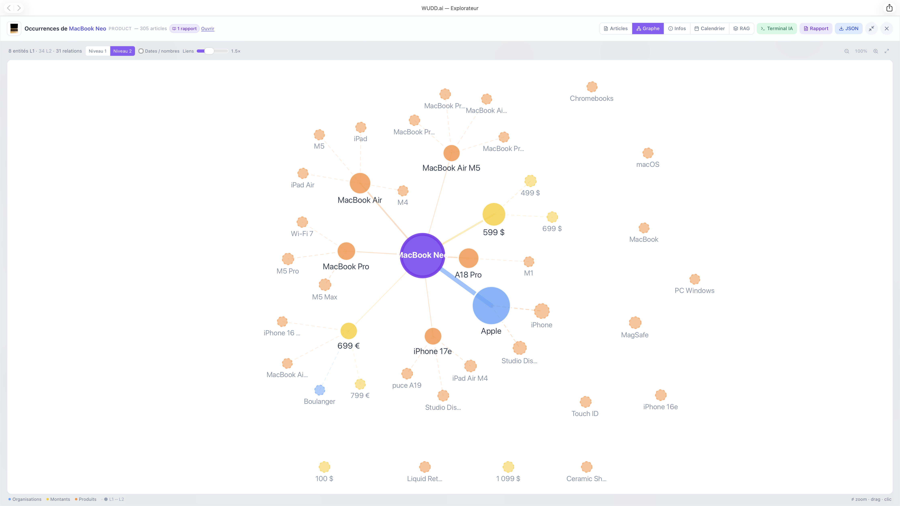
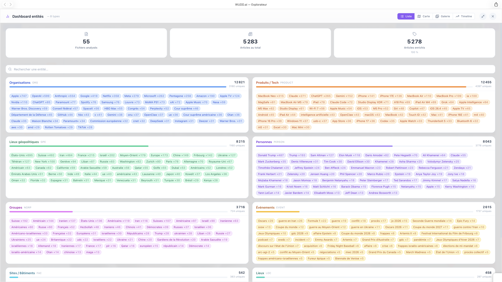
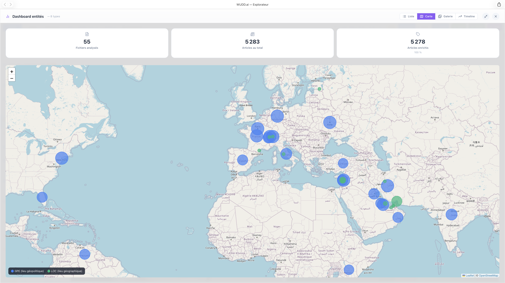
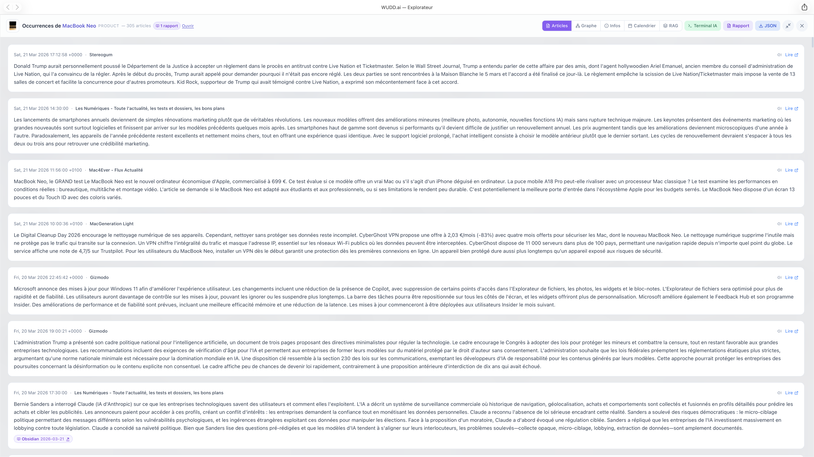

# Analyse sémantique par entités nommées (NER)

> Documentation fonctionnelle · Version 1.0 · Mars 2026

---

## Table des matières

1. [Principe : la sémantique référentielle](#1-principe--la-sémantique-référentielle)
2. [La sémantique relationnelle — le liant](#2-la-sémantique-relationnelle--le-liant)
3. [Les 18 types d'entités reconnus](#3-les-18-types-dentités-reconnus)
4. [Pipeline d'extraction NER](#4-pipeline-dextraction-ner)
5. [Dashboard Entités — Vue Liste](#5-dashboard-entités--vue-liste)
6. [Dashboard Entités — Vue Carte](#6-dashboard-entités--vue-carte)
7. [Dashboard Entités — Vue Galerie](#7-dashboard-entités--vue-galerie)
8. [Panneau de détail d'une entité](#8-panneau-de-détail-dune-entité)
9. [Données techniques](#9-données-techniques)
10. [API Export — accès par application tierce](#10-api-export--accès-par-application-tierce)

---

## 1. Principe : la sémantique référentielle

WUDD.ai analyse l'information selon trois couches sémantiques complémentaires :

**La sémantique lexicale** (mots-clés) identifie le *sujet* d'un texte — son domaine, son champ thématique. C'est la couche la plus basique du sens : dire qu'un article parle d'intelligence artificielle ou de géopolitique.

**La sémantique référentielle** (entités) va plus loin : elle reconnaît qu'un mot désigne un *acteur du réel* — une personne précise, une organisation existante, un pays, un produit commercial. On ne cherche plus seulement le thème, mais les protagonistes que le texte convoque.

C'est ce qu'on appelle la **reconnaissance d'entités nommées** (NER — *Named Entity Recognition*). Là où la sémantique lexicale dit « cet article parle d'IA », la sémantique référentielle dit « cet article cite OpenAI, Sam Altman et les États-Unis ».

Cette distinction fonde l'architecture du Dashboard Entités de WUDD.ai : au-delà de la classification thématique, l'utilisateur peut interroger directement les acteurs de l'information — qui est mentionné, combien de fois, dans quels articles.

---

## 2. La sémantique relationnelle — le liant

Ce qui rend WUDD.ai vraiment sémantique, c'est quand il commence à percevoir les **relations entre entités** : qui fait quoi, qui est lié à qui, quelle entité est associée à quel événement. C'est là que le sens devient structuré comme une connaissance.

La sémantique référentielle identifie des acteurs. La sémantique relationnelle révèle leurs **interdépendances** à travers le corpus d'articles : deux entités qui apparaissent fréquemment dans les mêmes textes entretiennent une relation — collaboration, opposition, co-implication dans un événement — que le graphe rend visible.

### Le graphe de co-occurrences

WUDD.ai matérialise cette couche relationnelle via un **graphe de co-occurrences interactif**, accessible depuis le panneau de détail de chaque entité (onglet *Graphe*).



**Principe de construction :**

- Chaque article portant un champ `entities` est parcouru ; toutes les entités qui y apparaissent ensemble forment des paires co-occurrentes.
- Le poids d'un lien entre deux entités est égal au nombre d'articles dans lesquels elles apparaissent simultanément.
- Le nœud central (entité consultée) est mis en évidence ; les nœuds voisins sont les entités les plus fréquemment co-occurrentes.

**Deux niveaux de profondeur :**

| Niveau | Description | Représentation |
| --- | --- | --- |
| **L1** | Entités directement co-occurrentes avec l'entité centrale | Nœuds pleins, couleur par type |
| **L2** | Entités co-occurrentes avec les nœuds L1 (relations de 2e degré) | Nœuds plus petits, contour pointillé, opacité réduite |

Le niveau L2 s'active via le bouton *"2 niveaux"* dans la barre de contrôle du graphe. Il permet de percevoir des acteurs périphériques ou des ponts thématiques entre entités a priori sans lien direct.

**Navigation relationnelle :**

Cliquer sur n'importe quel nœud du graphe ouvre le panneau de détail de cette entité avec son propre graphe de co-occurrences, permettant une **navigation relationnelle continue** à travers le réseau sémantique du corpus. Un historique de navigation permet de revenir en arrière.

**Contrôles du graphe :**

| Contrôle | Action |
| --- | --- |
| Molette / pinch | Zoom centré sur le curseur |
| Clic-glisser sur le fond | Déplacement (pan) |
| Clic sur un nœud | Navigation vers cette entité |
| Bouton *"2 niveaux"* | Affiche / masque les entités L2 |

Le graphe est calculé côté serveur (`/api/entities/cooccurrences`) et rendu en SVG pur côté client, sans dépendance à D3 ou autre bibliothèque de visualisation. Le layout utilise un algorithme de force simplifié (Fruchterman-Reingold, 240 itérations) avec répulsion différenciée entre nœuds L1 et L2.

### Important — différence entre `timeline`, `count` et `total_count`

Les trois métriques ne décrivent pas la même chose :

| Champ | Surface | Signification |
| --- | --- | --- |
| `timeline[YYYY-MM-DD]` | `/api/entities/timeline` | **Nombre de mentions quotidiennes** d'une entité pour chaque jour de la fenêtre demandée |
| `count` | `/api/entities/cooccurrences` | **Nombre d'articles partagés** entre le nœud source et le nœud cible dans le graphe courant (poids de l'arête) |
| `total_count` | `/api/entities/cooccurrences` | **Volume d'articles total associé au nœud**, utilisé comme contexte de taille, pas comme mesure diachronique |

Conséquences pratiques :

- La **timeline** sert à lire une évolution dans le temps ; c'est une série temporelle.
- Le **graphe** sert à lire une relation ; son `count` mesure une co-présence dans les mêmes articles, pas un nombre de mentions par jour.
- Le **`total_count` d'un voisin** dans le graphe est aujourd'hui calculé sur **l'ensemble du corpus indexé**, même si le graphe est filtré avec `days`.
- Le **`total_count` du nœud central** suit en revanche la fenêtre active du graphe, car il est dérivé des articles centraux déjà filtrés.
- L'endpoint renvoie désormais aussi `meta.total_count_scope` et `meta.edge_weight_scope` pour expliciter cette différence directement dans la réponse.

En pratique, il est donc normal que :

- la somme des valeurs de **timeline** sur 30 jours ne soit **pas égale** au `total_count` affiché dans le graphe ;
- un voisin ait un `total_count` élevé mais un `count` faible dans une fenêtre courte ;
- deux graphes avec des `days` différents gardent des tailles de nœuds proches tout en changeant fortement leurs poids d'arêtes.

### Paramètres de matching des endpoints entité

Point important : le diagnostic "couche de canonicalisation faible" est trompeur. La couche existe bien dans WUDD.ai, elle est exposée par l'API, et elle est même plus riche qu'un simple choix binaire entre fusion ou non-fusion. Le vrai enjeu est documentaire : sans explicitation des paramètres optionnels, un client MCP ou une intégration tierce reste sur le comportement historique et sous-exploite le moteur sémantique.

Autrement dit, WUDD.ai dispose déjà d'un moteur d'entités puissant ; il doit surtout être **appelé avec le bon mode** selon l'usage analytique recherché.

Les endpoints `GET /api/entities/timeline` et `GET /api/entities/articles` acceptent désormais plusieurs paramètres pour piloter le niveau d'agrégation et du tri :

| Paramètre | Valeurs | Effet |
| --- | --- | --- |
| `match_mode` | `strict`, `canonical`, `contains`, `aggregate` | Choisit la stratégie de résolution de l'entité demandée |
| `all_types` | `0` / `1` | Quand activé, autorise une recherche ou un agrégat sur tous les types NER |
| `sort_by` (`/articles`) | `date`, `score_source`, `score_ton`, `relevance` | Contrôle l'ordre des articles renvoyés |
| `max_articles` (`/articles`) | entier (1-2000) | Limite le nombre d'articles renvoyés |
| `limit` (`/articles`) | alias de `max_articles` | Alias de compatibilité REST (`?limit=...`) |

Toute autre valeur de `match_mode` est rejetée avec une erreur HTTP `400` pour éviter les replis silencieux vers le mode par défaut. Sur `/api/entities/articles`, les paramètres inconnus sont également rejetés en `400` (avec la liste `unknown_params`) pour éviter les erreurs silencieuses côté client.

#### Sémantique de `match_mode`

| Mode | Comportement |
| --- | --- |
| `strict` | Match exact sur la valeur brute dans le type demandé |
| `canonical` | Match exact après application des alias configurés et fusion des variantes Unicode exactes par type (`Trump` → `Donald Trump`, `'`/`’`, accents, casse) |
| `contains` | Match large par inclusion textuelle dans le type demandé — c'est le mode historique de la timeline |
| `aggregate` | Agrège toutes les variantes remontées par la recherche d'entités ; avec `all_types=1`, l'agrégat traverse tous les types NER |

#### Recommandation analytique

Pour un sujet politique ou institutionnel fragmenté (ex. `Trump`, `Macron`, `Conseil fédéral`) :

1. lancer `search_entities` pour cartographier les variantes ;
2. utiliser `match_mode=aggregate`;
3. activer `all_types=1` si l'analyse doit couvrir à la fois la personne, l'administration, les événements et les labels militants associés.

#### Lecture produit

Ce comportement doit être présenté comme un **point fort** du système :

- le mode par défaut reste simple et compatible avec l'historique ;
- les modes optionnels permettent d'augmenter la précision ou l'agrégation sans changer de backend ;
- l'API est donc plus puissante que ce que laissent penser ses descriptions minimales.

Pour un client MCP, la bonne posture n'est pas de supposer une canonicalisation absente, mais de considérer que :

1. `contains` sert à l'exploration rapide ;
2. `strict` et `canonical` servent à la vérification fine ;
3. `aggregate` et `all_types=1` servent à l'analyse transverse d'un sujet sémantiquement fragmenté.

`canonical` ne doit toutefois pas être confondu avec `aggregate` : il fusionne les variantes exactes d'un même libellé (ex. apostrophes typographiques, accents, casse) et les alias explicites, mais il ne regroupe pas les formulations longues ou les événements apparentés.

### Sémantique de `compact` sur `/api/entities/articles`

Le paramètre `compact=1` ne transforme pas l'endpoint en mode "résumé pauvre". Il retire surtout le champ `Titre` et conserve les champs directement utiles à l'analyse :

- métadonnées de base (`Date de publication`, `Sources`, `URL`, `Résumé`, `Images`) ;
- champs NER (`entities`) ;
- champs éditoriaux déjà enrichis (`sentiment`, `score_sentiment`, `ton_editorial`, `score_ton`, `score_source`, `enrichissement_statut`) ;
- champs de lecture (`temps_lecture_minutes`, `temps_lecture_label`) ;
- métadonnées d'origine (`fichier_source`, `terme_declencheur`, etc.).

Pour un usage RAG, panel entité ou note de veille, `compact=1` reste donc généralement suffisant.

### Couverture de `sentiment_7j`

Dans `duckdb_stats`, le bloc `sentiment_7j` décrit uniquement les articles RSS des 7 derniers jours **ayant un champ `sentiment` non vide**. La réponse expose maintenant `duckdb_stats.sentiment_7j_meta` avec :

- `sample_size` : nombre d'articles réellement inclus dans la distribution ;
- `coverage_pct_of_reading_time_7j` : part de cet échantillon par rapport au volume analytique 7 jours exposé par `reading_time_7j.total_articles` ;
- `basis` : rappel textuel du critère d'inclusion.

La réponse expose aussi `duckdb_stats.enrichment_7j`, qui sert à lire l'état du pipeline plutôt qu'une vérité implicite sur tout le corpus :

- `total_articles` : volume RSS observé sur 7 jours ;
- `with_entities`, `with_sentiment`, `with_score_source`, `editorial_ready`, `ok_status` : compteurs de complétude par étape ;
- `enrichissement_pct` : part des articles marqués `enrichissement_statut="ok"` ;
- `sentiment_coverage_pct`, `score_source_coverage_pct`, `entities_coverage_pct`, `editorial_ready_pct` : taux de couverture détaillés.

### Types structurels et types atypiques

Le moteur indexe désormais aussi `WORK_OF_ART` par défaut. Les types structurels (`DATE`, `TIME`, `MONEY`, `QUANTITY`, `PERCENT`, `CARDINAL`, `ORDINAL`) sont bien conservés dans l'index, mais restent **masqués par défaut** dans les surfaces de découverte pour éviter de polluer les vues principales.

Pour les exposer volontairement :

| Endpoint | Paramètre | Effet |
| --- | --- | --- |
| `GET /api/entities/search` | `include_structural=1` | Inclut les types structurels dans la recherche d'entités |
| `GET /api/entities/dashboard` | `include_structural=1` | Ajoute les types structurels à la distribution globale du dashboard |
| `GET /api/entities/timeline` | `include_structural=1` | Autorise la timeline sur `DATE`, `MONEY` et autres types structurels |

Cela permet de garder un dashboard lisible pour l'usage courant, tout en rendant possible une analyse ciblée des montants, dates et autres entités structurelles quand c'est pertinent.

**Important :** ces types dépendent de l'état de `data/entity_index.json`. Après une évolution du schéma d'indexation, il faut reconstruire l'index entités puis régénérer `data/entity_stats.json`, sinon le dashboard et la recherche peuvent continuer à refléter un ancien état du corpus.

### Correctifs de qualité NER appliqués

WUDD.ai applique désormais un post-traitement léger sur les sorties NER pour corriger certains cas manifestement erronés avant indexation :

- les montants explicites sont recentrés vers `MONEY` ;
- les années et dates explicites sont recentrées vers `DATE` ;
- les lois et règlements nommés sont recentrés vers `LAW` lorsqu'ils ont été classés ailleurs.
- certains faux positifs courts très récurrents sont recentrés vers leur type canonique métier (ex. `Trump` vers `PERSON`, `Conseil fédéral` vers `ORG`) ;
- certaines variantes culturelles mal classées peuvent aussi être rabattues vers `WORK_OF_ART` via la canonicalisation configurée.

Ce correctif ne remplace pas la qualité du modèle amont, mais il réduit les faux positifs les plus coûteux pour l'exploration analytique.

Exemple concret : le sujet `Dune` peut apparaître à la fois comme film, roman, saga ou produit mal typé. Après réindexation et canonicalisation, la recherche remonte désormais `Dune` d'abord comme `WORK_OF_ART`, les faux positifs résiduels restant isolés dans des types secondaires.

---

## 3. Les 18 types d'entités reconnus

### Norme de référence : OntoNotes 5.0 / spaCy

Le schéma de typage adopté est celui du corpus **OntoNotes 5.0**, développé conjointement par l'Université de Pennsylvanie, BBN Technologies et USC ISI. Il s'agit de la norme de facto pour la NER en production, popularisée par la bibliothèque **spaCy** et adoptée par la majorité des grands modèles de langue actuels.

Ce choix assure une compatibilité maximale avec l'écosystème NLP : les types sont stables, documentés, et interopérables avec les outils tiers (spaCy, Hugging Face, etc.).

> **Note d'implémentation :** l'extraction n'est pas réalisée par un pipeline NLP classique (spaCy, stanza…) mais par **prompt soumis au LLM** (Qwen/Qwen3.5-122B-A10B-FP8 via l'API EurIA). Le modèle retourne directement les entités au format JSON structuré, en appliquant la taxonomie OntoNotes. Cette approche est plus flexible sur les textes français et les entités récentes, mais peut produire des résultats variables selon la qualité du résumé source.

---

L'extraction NER identifie 18 types d'entités couvrant les dimensions essentielles de l'information d'actualité :

| Catégorie | Types | Exemples |
| --- | --- | --- |
| **Acteurs** | `PERSON`, `ORG`, `NORP` | Sam Altman, OpenAI, Démocrates |
| **Géographie** | `GPE`, `LOC`, `FAC` | États-Unis, Alpes, Tour Eiffel |
| **Objets** | `PRODUCT`, `WORK_OF_ART`, `LAW` | ChatGPT, *Nature*, RGPD |
| **Événements** | `EVENT` | Forum de Davos |
| **Temporel** | `DATE`, `TIME` | 2026, 14h00 |
| **Quantitatif** | `MONEY`, `QUANTITY`, `PERCENT`, `CARDINAL`, `ORDINAL` | 150 M$, 3 milliards, 12 %, cinquième |
| **Linguistique** | `LANGUAGE` | français, anglais |

---

## 4. Pipeline d'extraction NER

### 4.1 Enrichissement a posteriori

L'extraction NER est assurée par `scripts/enrich_entities.py`, qui soumet le champ `Résumé` de chaque article à l'API EurIA (Qwen/Qwen3.5-122B-A10B-FP8) avec un prompt spécialisé.

```bash
# Enrichir tous les articles existants
python3 scripts/enrich_entities.py

# Un flux spécifique
python3 scripts/enrich_entities.py --flux Intelligence-artificielle

# Simulation sans appel API
python3 scripts/enrich_entities.py --dry-run
```

Le script ne ré-enrichit pas les articles déjà traités (sauf avec `--force`). La sauvegarde est atomique (`.tmp` → remplacement).

### 4.2 Enrichissement en temps réel

Le script `scripts/get-keyword-from-rss.py` (collecte quotidienne par mot-clé) intègre l'extraction NER directement lors de la génération du résumé : chaque article est enrichi sans étape séparée.

### 4.3 Format de stockage

Les entités sont ajoutées dans le JSON de l'article sous la clé `entities` :

```json
{
  "entities": {
    "PERSON": ["Sam Altman", "Elon Musk"],
    "ORG":    ["OpenAI", "Tesla"],
    "GPE":    ["États-Unis", "Europe"],
    "PRODUCT": ["ChatGPT", "Grok"],
    "DATE":   ["2026"],
    "MONEY":  ["150 millions de dollars"]
  }
}
```

Seuls les types effectivement détectés sont présents. Les types avec zéro entité sont omis.

---

## 5. Dashboard Entités — Vue Liste

**Accès** : bouton `Liste` dans le Dashboard Entités (barre de navigation du Viewer).

La vue Liste offre une lecture transversale de toutes les entités extraites de l'ensemble des fichiers JSON analysés.



### En-tête de statistiques

Trois indicateurs globaux sont affichés en permanence :

| Indicateur | Signification |
| --- | --- |
| **Fichiers analysés** | Nombre de fichiers JSON parcourus |
| **Articles au total** | Nombre d'articles trouvés dans ces fichiers |
| **Articles enrichis** | Articles possédant un champ `entities` (avec taux de couverture) |

### Sections par type

Chaque type d'entité est présenté dans une section dédiée avec :

- **Compteur total** : nombre d'occurrences agrégées (toutes mentions de ce type dans tous les articles)
- **Compteur unique** : nombre d'entités distinctes
- **Barre de proportion** : largeur relative au type le plus fréquent
- **Nuage de tags cliquables** : top entités du type, avec compteur de mentions

Cliquer sur n'importe quelle entité ouvre le [panneau de détail](#8-panneau-de-détail-dune-entité).

---

## 6. Dashboard Entités — Vue Carte

**Accès** : bouton `Carte` dans le Dashboard Entités.

La vue Carte géolocalise les entités de type `GPE` (lieux géopolitiques : pays, villes, régions) et `LOC` (lieux géographiques : chaînes de montagnes, fleuves, zones) sur un planisphère interactif.



### Encodage visuel

| Élément | Signification |
| --- | --- |
| Couleur **bleue** | Entité `GPE` (lieu géopolitique) |
| Couleur **verte** | Entité `LOC` (lieu géographique) |
| **Taille du cercle** | Proportionnelle au nombre de mentions (échelle logarithmique) |

### Interactivité

- **Survol** : tooltip affichant le nom, le type et le nombre de mentions
- **Clic** : ouvre le [panneau de détail](#8-panneau-de-détail-dune-entité) de l'entité
- **Zoom** : molette ou boutons +/−, navigation libre sur la carte
- **Fond cartographique** : tuiles OpenStreetMap chargées à la volée

### Géocodage Wikipedia

Les coordonnées géographiques sont récupérées via l'API Wikipedia (`action=query&prop=coordinates`), avec priorité à `fr.wikipedia.org` et fallback sur `en.wikipedia.org`. Les résultats sont mis en cache dans `data/geocode_cache.json` (TTL illimité). Les entités sans coordonnées connues (lieux abstraits, zones vastes) n'apparaissent pas sur la carte.

> Si la carte est vide ou incomplète malgré des entités GPE/LOC présentes, supprimer `data/geocode_cache.json` pour forcer le re-géocodage (peut indiquer un cache pollué par des erreurs réseau antérieures).

---

## 7. Dashboard Entités — Vue Galerie

**Accès** : bouton `Galerie` dans le Dashboard Entités.

La vue Galerie affiche une représentation visuelle des entités de type `PERSON`, `ORG` et `PRODUCT`, organisée en trois sections alphabétiques avec images récupérées depuis Wikimedia.

### Organisation de la galerie

| Section | Type | Format des tuiles | Image source |
| --- | --- | --- | --- |
| **Personnes** | `PERSON` | Portrait (hauteur fixe, `object-cover`) | Wikipedia `pageimages` |
| **Organisations** | `ORG` | Carré (`aspect-ratio: 1`, `object-contain`) | Wikidata P154 (logo officiel) |
| **Produits / Tech** | `PRODUCT` | Carré (`aspect-ratio: 1`, `object-contain`) | Wikidata P154 → fallback Wikipedia |

Les tuiles sont triées **alphabétiquement** au sein de chaque section. L'en-tête de section indique le nombre d'images trouvées sur le total (`27 images / 50`).

### Contrôle du zoom

Un curseur en haut de la galerie permet d'ajuster le nombre de colonnes de 2 à 15 (défaut : 10). La hauteur des portraits s'adapte automatiquement au nombre de colonnes.

### Placeholder pour les entités sans image

Lorsqu'aucune image n'est disponible — soit parce que l'entité est absente de Wikipedia/Wikidata, soit parce que son nom est ambigu (voir ci-dessous) — la tuile affiche un **placeholder** coloré avec les initiales de l'entité :

| Type | Couleur du placeholder |
| --- | --- |
| `PERSON` | Fond violet, texte violet |
| `ORG` | Fond bleu, texte bleu |
| `PRODUCT` | Fond orange, texte orange |

### Stratégie d'images et filtrage des faux positifs

La recherche d'images utilise trois APIs Wikimedia selon le type d'entité :

**Pour PERSON** — Wikipedia `pageimages` (API `prop=pageimages&pithumbsize=200`) :
L'image principale de la page Wikipedia de la personne est retournée. Requête FR d'abord, EN en fallback.

**Pour ORG et PRODUCT** — Wikidata P154 (propriété « logo image ») :
La propriété P154 de Wikidata contient le fichier officiel du logo. Le nom du fichier est ensuite résolu via l'API `imageinfo` de Wikimedia Commons pour obtenir l'URL de la miniature. Si aucun P154 n'existe mais que l'entité est identifiée comme une organisation/produit (P31 ∈ liste blanche), un fallback vers `pageimages` est tenté.

**Règle de rejet des noms ambigus :**

Certains noms de produits ou d'organisations correspondent à des articles Wikipedia hors-scope. Pour éviter d'afficher une image incorrecte (ex. portrait d'une personne pour un produit IA, photo d'un manuscrit pour un logiciel), l'entité Wikidata trouvée est rejetée — et le placeholder initiales est affiché — si :

- son P31 (« instance de ») appartient aux types disqualifiants : `Q5` (humain), `Q202444` (prénom), `Q101352` (nom de famille), `Q4167410` (homonymie)
- son P31 est absent ou n'inclut aucun type compatible (entreprise, logiciel, organisation…)

Exemples de noms correctement filtrés vers le placeholder : *Claude* (prénom français), *Codex* (manuscrit médiéval), *Word* (mot du dictionnaire), *Gemini* (signe du zodiaque).

Les images acceptées sont mises en cache dans `data/images_cache.json` (TTL illimité). Supprimer ce fichier pour forcer un re-téléchargement complet.

---

## 8. Panneau de détail d'une entité

**Accès** : cliquer sur n'importe quelle entité dans les trois vues (Liste, Carte, Galerie).



Le panneau latéral affiche la liste de tous les articles mentionnant l'entité sélectionnée, avec :

- **Date** et **source** de l'article
- **Extrait** du résumé IA (début du champ `Résumé`)
- **Lien « Lire »** vers l'URL originale de l'article

### Actions disponibles

| Bouton | Action |
| --- | --- |
| **Générer un rapport** | Soumet les articles filtrés à l'API EurIA et télécharge un rapport Markdown thématique |
| **Exporter JSON** | Télécharge un fichier JSON contenant uniquement les articles mentionnant cette entité |

Ces deux exports permettent d'approfondir l'analyse sur un acteur précis — par exemple, générer un rapport sur toutes les mentions d'une organisation sur une période donnée.

---

## 9. Données techniques

### Fichiers impliqués

| Fichier / Module | Rôle |
| --- | --- |
| `scripts/enrich_entities.py` | Extraction NER a posteriori sur tous les articles |
| `scripts/get-keyword-from-rss.py` | Extraction NER intégrée lors de la collecte quotidienne |
| `utils/api_client.py` — `generate_entities()` | Client EurIA pour l'extraction NER |
| `viewer/app.py` — `/api/entities` | Agrégation cross-fichiers des entités (comptage, top par type) |
| `viewer/app.py` — `/api/entities/geocode` | Géocodage Wikipedia des entités GPE/LOC |
| `viewer/app.py` — `/api/entities/images` | Images Wikipedia/Wikidata pour la galerie |
| `viewer/app.py` — `/api/entities/articles` | Articles filtrés par entité (panneau de détail) |
| `viewer/src/components/EntityDashboard.jsx` | Composant React principal (statistiques + toggles) |
| `viewer/src/components/EntityWorldMap.jsx` | Carte interactive (react-leaflet + OpenStreetMap) |
| `viewer/src/components/EntityGallery.jsx` | Galerie d'images avec placeholders |
| `viewer/src/components/EntityArticlePanel.jsx` | Panneau de détail flottant (articles + graphe) avec export |
| `viewer/src/components/EntityGraph.jsx` | Graphe de co-occurrences SVG avec layout de force |
| `viewer/app.py` — `/api/entities/cooccurrences` | Calcul des co-occurrences entre entités, profondeur 1 ou 2 |
| `data/geocode_cache.json` | Cache coordonnées Wikipedia (TTL illimité) |
| `data/images_cache.json` | Cache images Wikimedia (TTL illimité) |

### Performances et limites

- **Volume typique** : jusqu'à 50 entités par type sont affichées dans les vues Carte et Galerie
- **Batchs Wikimedia** : 50 entités par requête (Wikipedia, Wikidata, Commons)
- **Timeout API Wikimedia** : 10 s par requête
- **Couverture images** : variable selon la notoriété des entités — les personnalités mondiales et grandes entreprises tech ont quasi-systématiquement une image ; les entités locales ou récentes peuvent en manquer
- **Couverture géocodage** : limitée aux entités ayant une page Wikipedia avec coordonnées — les zones géographiques abstraites (« Europe », « Occident ») ne sont pas géolocalisables

### Caches et invalidation

```bash
# Forcer le re-géocodage de toutes les entités
docker exec analyse-actualites rm -f /app/data/geocode_cache.json

# Forcer le re-téléchargement de toutes les images
docker exec analyse-actualites rm -f /app/data/images_cache.json
```

---

## 10. API Export — accès par application tierce

> Version 2.4 · Avril 2026

Le endpoint `GET /api/entities/export` permet à n'importe quelle application externe de consommer les entités NER de WUDD.ai en un seul appel HTTP, sans authentification.

### URL

```
GET http://<hôte>:5050/api/entities/export
```

### Paramètres de requête

| Paramètre | Type | Défaut | Description |
|-----------|------|--------|-------------|
| `q` | string | — | Filtre textuel partiel sur le nom de l'entité (insensible à la casse) |
| `type` | string | — | Filtre sur le type NER : `PERSON`, `ORG`, `GPE`, `LOC`, `PRODUCT`, `EVENT`, `NORP`, `FAC`… |
| `limit` | int | `200` | Nombre max d'entités retournées (min 1, max 5000) |
| `sort` | string | `mentions` | Tri : `mentions` (plus cité en premier) ou `value` (ordre alphabétique) |
| `match_mode` | string | `canonical` | Stratégie de regroupement : `canonical`, `strict`, `contains`, `aggregate` |
| `images` | bool | `true` | Inclure les images depuis le cache disque (`data/images_cache.json`) |
| `synthesis` | bool | `false` | Inclure les synthèses IA depuis `data/synthesis_cache.json` (TTL 24h) |

### Cache HTTP conditionnel

L'endpoint supporte la validation conditionnelle via les en-têtes HTTP standards :

- `If-Modified-Since` côté client
- `Last-Modified` côté serveur

Si rien n'a changé côté données (index entités, cache images, cache synthèses selon les options), l'API peut répondre `304 Not Modified` sans renvoyer le payload JSON complet.

### Exemples d'appels

```bash
# Toutes les entités top 200, triées par nombre de mentions, avec images
curl http://localhost:5050/api/entities/export

# Rechercher « Macron » avec la synthèse IA
curl "http://localhost:5050/api/entities/export?q=macron&synthesis=true"

# Toutes les organisations, sans images, triées alphabétiquement, max 1000
curl "http://localhost:5050/api/entities/export?type=ORG&images=false&sort=value&limit=1000"

# Top 5 entités pour un widget externe
curl "http://localhost:5050/api/entities/export?limit=5&sort=mentions"
```

### Format de réponse

```json
{
  "generated_at": "2026-04-06T10:30:00+00:00",
  "total":    1234,
  "returned": 200,
  "params": {
    "q":         null,
    "type":      null,
    "limit":     200,
    "sort":      "mentions",
    "match_mode": "canonical",
    "images":    true,
    "synthesis": false
  },
  "entities": [
    {
      "type":     "PERSON",
      "value":    "Emmanuel Macron",
      "mentions": 42,
      "image": {
        "url":    "https://upload.wikimedia.org/…/macron.jpg",
        "width":  200,
        "height": 200
      }
    },
    {
      "type":     "ORG",
      "value":    "OpenAI",
      "mentions": 38,
      "image": {
        "url":    "https://upload.wikimedia.org/…/openai.png",
        "width":  200,
        "height": 200
      }
    },
    {
      "type":     "GPE",
      "value":    "France",
      "mentions": 21,
      "image":    null
    }
  ]
}
```

### Description des champs de réponse

| Champ | Description |
|-------|-------------|
| `generated_at` | Horodatage ISO-8601 UTC de la génération de la réponse |
| `total` | Nombre total d'entités correspondant aux filtres (avant `limit`) |
| `returned` | Nombre d'entités effectivement retournées dans `entities` |
| `params` | Rappel des paramètres effectifs utilisés pour la requête |
| `entities[].type` | Type NER (PERSON, ORG, GPE, LOC, PRODUCT…) |
| `entities[].value` | Nom de l'entité dans sa forme d'affichage canonique (majuscules préservées) |
| `entities[].mentions` | Nombre total de références dans l'index |
| `entities[].aliases` | Variantes regroupées (présent quand plusieurs formes sont fusionnées) |
| `entities[].image` | Objet `{url, width, height}` depuis le cache Wikimedia, ou `null` si non disponible |
| `entities[].synthesis` | Texte Markdown de la synthèse IA (uniquement si `synthesis=true`) |

### Headers de réponse

| Header | Valeur |
|--------|--------|
| `Access-Control-Allow-Origin` | `*` (CORS ouvert pour toutes les origines) |
| `Cache-Control` | `no-cache` |
| `Content-Type` | `application/json` |

### Notes d'intégration

- **Images** : proviennent de `data/images_cache.json` (cache disque constitué progressivement par `POST /api/entities/images`). Si une entité n'a pas encore été recherchée, son champ `image` vaut `null`.
- **Synthèses** : proviennent de `data/synthesis_cache.json` avec une TTL de 24h. Elles sont générées à la demande via le panneau d'entité de l'interface, ou par `GET /api/entities/info`.
- **Fallback** : si `data/entity_index.json` est indisponible ou corrompu, l'endpoint bascule automatiquement sur un scan rglob des répertoires `data/articles/` et `data/articles-from-rss/`.
- **Tests** : couverture complète dans `tests/test_entity_export.py` (36 tests, 0 appel API réel).
