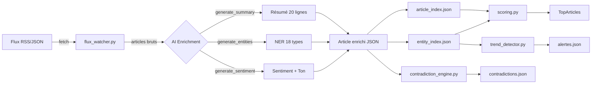
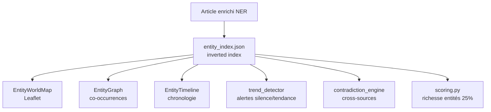
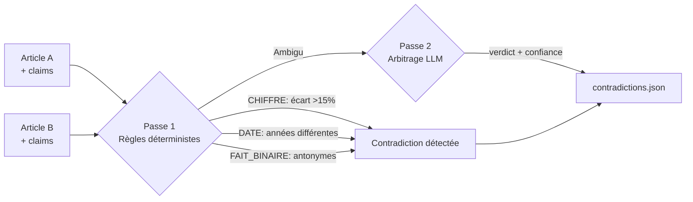
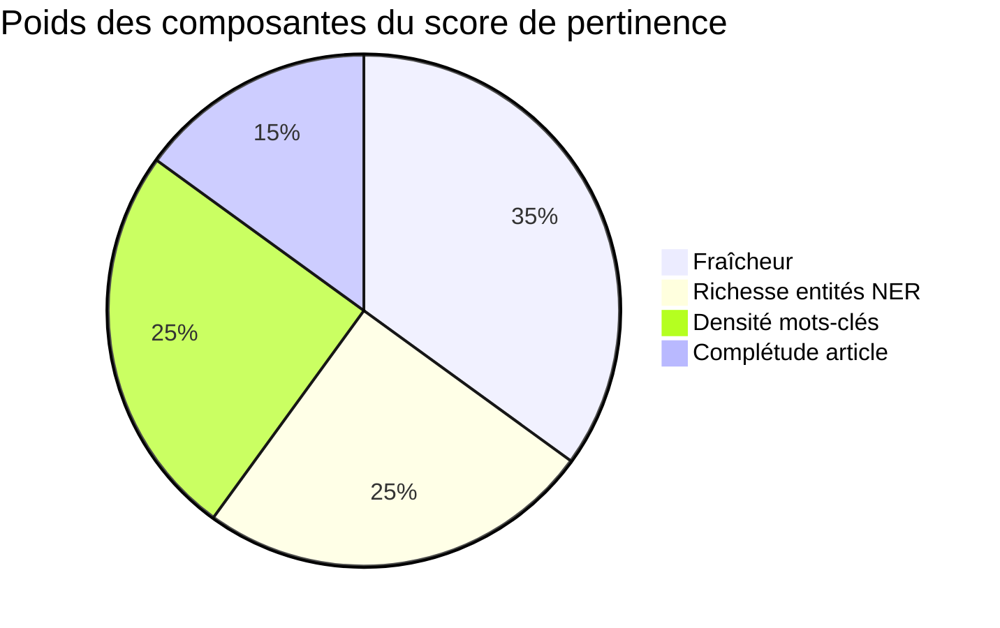
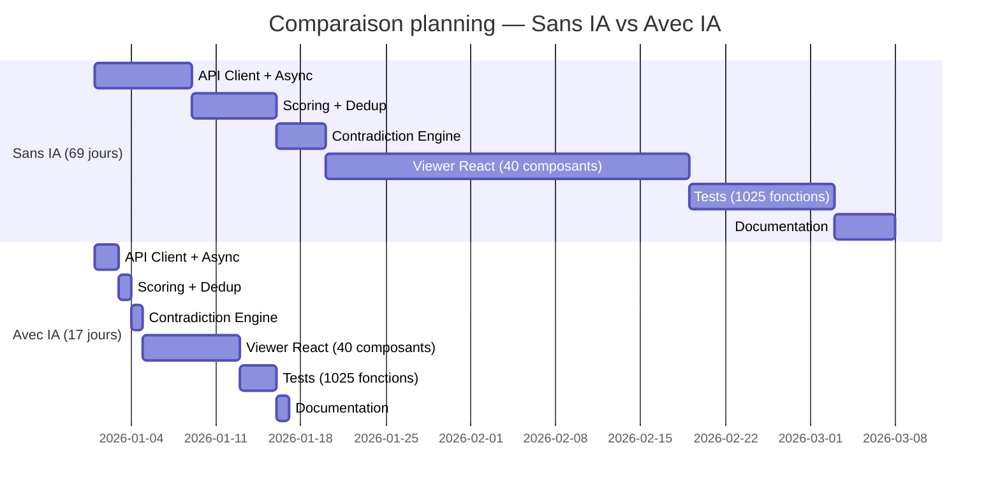
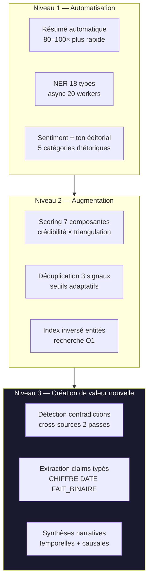

# L'IA comme moteur d'enrichissement des systèmes d'information

---
WUDD.ai est une plateforme de veille intelligente de 57 000+ lignes de code qui illustre trois niveaux d'impact de l'IA sur les systèmes d'information : automatisation (résumé, NER), augmentation (scoring, déduplication) et création de valeur nouvelle impossible sans LLM (détection de contradictions, extraction de claims, synthèses narratives). L'analyse du dépôt [pat-the-geek/WUDD.ai](https://github.com/pat-the-geek/WUDD.ai) révèle une accélération du développement de 4–5× par rapport à un développement traditionnel, avec une qualité structurelle supérieure (1 025 tests automatisés, documentation continue). La rupture fondamentale n'est pas de faire plus vite ce qui existait — c'est de rendre possible ce qui ne l'était pas.
---

Table des matières
{{TOC}}

===

## 1. Périmètre et architecture du logiciel

WUDD.ai (*Analyse Actualités*) est une plateforme de veille intelligente en français qui ingère des flux RSS/JSON, enrichit les articles via des LLM, et produit rapports structurés, alertes et visualisations interactives. Le dépôt source est disponible sur [GitHub — pat-the-geek/WUDD.ai](https://github.com/pat-the-geek/WUDD.ai).

### Métriques du code source

| Composant | Fichiers | Lignes |
|---|---|---|
| Scripts CLI (`scripts/`) | 50 | 14 198 |
| Modules utilitaires (`utils/`) | 31 | 10 106 |
| Interface web React (`viewer/`) | 40+ JSX | 23 718 |
| Backend Flask | 8 routes | 8 881 |
| Tests automatisés | 25 | 10 188 |
| **Total production** | **~150** | **~57 000+** |

### Architecture de la chaîne de traitement



### Providers IA supportés

| Provider | Modèle | Usage |
|---|---|---|
| EurIA / Infomaniak | Qwen3 | Provider par défaut — résumés, NER, sentiments |
| Anthropic | Claude Sonnet 4.6 | Provider alternatif — prompt caching, synthèses |

---

## 2. Fonctions rendues possibles uniquement par l'IA

### 2.1 Résumé automatique (`generate_summary`)

`utils/api_client.py` (1 597 lignes) réduit un article brut en un résumé structuré de 20 lignes en français. La fonction `generate_summary_with_sentiment()` fusionne résumé + sentiment en **un seul appel API** pour optimiser les coûts et la latence.

**Comparaison humain vs IA :**

| | Humain | WUDD.ai avec IA |
|---|---|---|
| Temps par article | 5–7 min | ~3–5 secondes |
| Capacité nocturne | ~60 articles | 500–1 000+ articles |
| Coût unitaire estimé | ~0,50 € (salaire) | ~0,002 € (token) |
| **Accélération** | **1×** | **~80–100×** |

Ce n'est pas une optimisation — c'est un changement de catégorie. Un humain ne peut pas résumer 1 000 articles par nuit.

---

### 2.2 Extraction d'entités nommées — NER (`generate_entities`)

`enrich_entities.py` + `utils/async_enricher.py` enrichissent chaque article avec **18 catégories d'entités** via `aiohttp` (concurrence jusqu'à 20 workers parallèles).

**Exemple de sortie :**

```json
"entities": {
  "PERSON": ["Emmanuel Macron", "Sam Altman"],
  "ORG":    ["OpenAI", "Infomaniak"],
  "GPE":    ["France", "Paris"],
  "PRODUCT":["ChatGPT"]
}
```

**Pipeline de valorisation des entités NER :**



**Ce qui était impossible sans IA :** La détection en contexte multilingue, la résolution d'ambiguïté ("Apple" = entreprise ou fruit ?), et la mise à jour continue sans ré-entraînement de modèle ML.

---

### 2.3 Analyse de sentiment et ton éditorial (`generate_sentiment`)

`enrich_sentiment.py` ajoute quatre champs à chaque article :

```json
"sentiment":       "positif",
"score_sentiment": 4,
"ton_editorial":   "factuel",
"score_ton":       5
```

Le `ton_editorial` distingue : `factuel`, `alarmiste`, `promotionnel`, `critique`, `analytique`. Ce n'est pas un classificateur binaire — c'est une analyse rhétorique fine impossible à obtenir avec VADER ou TextBlob, surtout en français.

---

### 2.4 Détection de contradictions entre sources

Pipeline en deux passes (`detect_contradictions.py` + `utils/contradiction_engine.py`) :



**Passe 1 — Déterministe (zéro LLM, ultra-rapide) :**
- `CHIFFRE` : divergence > 15% entre nombres (avec parsing milliards/millions)
- `DATE` : années différentes sur le même événement
- `FAIT_BINAIRE` : 32 paires d'antonymes français/anglais intégrées

**Passe 2 — Arbitrage LLM :**
Le LLM reçoit les deux articles + leurs scores de crédibilité source et rend un verdict avec score de confiance. Ce que les règles ne peuvent pas arbitrer : "le traité a été signé" vs "le traité a été suspendu" — car cela nécessite de comprendre le sens.

---

### 2.5 Extraction de claims factuels (`claim_extractor.py`)

Le LLM extrait des affirmations atomiques typées depuis le résumé :

```json
{
  "claim":     "Le PIB a augmenté de 2,3%",
  "type":      "CHIFFRE",
  "sujet":     "PIB France",
  "valeur":    "2.3",
  "confiance": 0.92
}
```

**Cinq types** : `CHIFFRE`, `DATE`, `FAIT_BINAIRE`, `ATTRIBUTION`, `AUTRE`. La confiance (0.0–1.0) mesure la vérifiabilité. Ces claims sont la matière première de la détection de contradictions.

---

### 2.6 Génération de rapports narratifs

`generate_morning_digest.py`, `generate_briefing.py`, `generate_48h_report.py` — le LLM synthétise les top articles en briefings exécutifs structurés. La valeur réside dans la narrativité temporelle : *"les tensions entre X et Y s'intensifient depuis 3 jours"* — impossible à automatiser sans compréhension contextuelle.

---

### 2.7 Synthèse d'entités en streaming (`EntityFullReportDialog.jsx`)

En cliquant sur une entité dans le dashboard, le système génère en streaming SSE une synthèse progressive : informations contextuelles → RAG sur les articles → analyse temporelle. Le résultat est mis en cache 24h (`data/synthesis_cache.json`) pour éviter les appels redondants.

---

## 3. Fonctions augmentées (existantes mais transformées par l'IA)

### 3.1 Scoring de pertinence à 7 composantes (`utils/scoring.py`)



| Composante | Poids | Mécanisme |
|---|---|---|
| Fraîcheur | 35% | Décroissance exponentielle (24h=100, 7j≈20, 30j≈5) |
| Richesse entités | 25% | PERSON=1.5×, ORG=1.3×, GPE=1.2× |
| Densité mots-clés | 25% | Correspondance watchlist personnalisée |
| Complétude | 15% | Résumé + images + champs d'enrichissement |
| Crédibilité source | multiplicateur | 0.0–1.0 depuis `sources_credibility.json` |
| Bonus triangulation | +0 à +10 pts | ≥2 sources sur même événement (Jaccard ≥ 0.35) |
| Malus irrégularité | −0 à −10 pts | Sources erratiques pénalisées |

**Sans NER :** les composantes "richesse entités" et "triangulation" seraient impossibles. Le score serait réduit à fraîcheur + mots-clés — soit une recherche full-text classique sans valeur éditoriale.

### 3.2 Déduplication adaptative (`utils/deduplication.py`)

Trois signaux avec seuils adaptatifs selon longueur du texte :

| Signal | Mécanisme | Seuil court (<80 mots) | Seuil moyen | Seuil long (>200 mots) |
|---|---|---|---|---|
| URL MD5 | Normalisation + hachage | exact | exact | exact |
| Résumé MD5 | Premiers 200 caractères | exact | exact | exact |
| Jaccard bigrammes | Similarité textuelle | 0.70 | 0.80 | 0.85 |

Sans les résumés IA, la déduplication se limiterait aux URL — on manquerait tous les articles reprenant la même dépêche AFP depuis des sources différentes.

---

## 4. Ce qui était impossible sans IA — Synthèse comparative

| Fonctionnalité | Approche pré-IA | Limite insurmontable |
|---|---|---|
| Résumé automatique | TextRank (extractif) | Pas de reformulation, perd le contexte |
| NER contextuelle | spaCy + dictionnaires | Ambiguïté non résolue, pas multilingue |
| Ton éditorial | Lexiques de polarité | Pas de rhétorique, anglais uniquement |
| Détection contradictions | Règles + regex | Sémantique impossible à encoder |
| Synthèse narrative | Agrégation de titres | Pas de narration causale/temporelle |
| Extraction de claims | NLP classique | Typage sémantique structuré impossible |
| Q&A sur le corpus | Recherche full-text | Pas de raisonnement sur les documents |
| Traduction automatique | Google Translate API | Disponible mais non intégré (voir §6) |

**La rupture fondamentale :** Les outils NLP classiques traitent des *formes* (tokens, n-grammes, distances de Levenshtein). Les LLM traitent du *sens*. WUDD.ai exploite cette différence sur l'intégralité de sa chaîne de valeur.

---

## 5. Gain de productivité : développement assisté par IA

### 5.1 Estimation du temps de développement

| Composant | Complexité | Sans IA | Avec IA |
|---|---|---|---|
| `utils/api_client.py` (1 597 lignes, CircuitBreaker, dual-provider) | Très haute | 5–8 jours | 1–2 jours |
| `utils/scoring.py` (7 composantes, ScoringEngine) | Haute | 3–5 jours | 0,5–1 jour |
| `utils/contradiction_engine.py` (2 passes, 32 antonymes) | Haute | 2–4 jours | 0,5 jour |
| `utils/async_enricher.py` (asyncio + fallback sync) | Haute | 2–3 jours | 0,5 jour |
| `utils/deduplication.py` (3 signaux adaptatifs) | Moyenne | 1–2 jours | 0,25 jour |
| `viewer/` React complet (40+ composants, Leaflet, D3) | Très haute | 20–30 jours | 5–8 jours |
| Tests (1 025 fonctions, 25 fichiers) | Haute | 8–12 jours | 2–3 jours |
| Documentation (CLAUDE.md, CHANGELOG, USAGE.md) | Moyenne | 3–5 jours | 0,5–1 jour |
| **TOTAL estimé** | | **44–69 jours** | **10–17 jours** |

### 5.2 Ratio d'accélération

```mermaid
xychart-beta
    title "Jours de développement estimés"
    x-axis ["api_client", "scoring", "contradiction", "async", "dedup", "viewer React", "tests", "docs"]
    y-axis "Jours" 0 --> 30
    bar [6, 4, 3, 2.5, 1.5, 25, 10, 4]
    bar [1.5, 0.75, 0.5, 0.5, 0.25, 6.5, 2.5, 0.75]
```



```
Accélération globale = Temps sans IA / Temps avec IA
                     = 44–69 jours / 10–17 jours
                     ≈ 4× à 5× plus rapide
```

**En termes humains : un projet de 3 mois solo livré en 3 semaines.** Ce n'est pas seulement de la vitesse — c'est la capacité à maintenir la cohérence sur 57 000 lignes, à générer des tests exhaustifs, et à documenter en continu sans perte de contexte.

### 5.3 Qualité du code produit avec IA

| Indicateur | Valeur observée | Benchmark standard |
|---|---|---|
| Ratio tests/modules | ~33 tests/module | ~5–10 tests/module |
| Patterns avancés dès v1 | CircuitBreaker, Singleton, asyncio | Arrivent généralement tard |
| Documentation inline | CLAUDE.md 400+ lignes, à jour | Souvent oubliée |
| Gestion d'erreurs | 5 états CircuitBreaker | Généralement try/except basique |
| Couverture cible | ≥ 80% sur `utils/` | ~40–60% en solo |

### 5.4 Comparaison vitesse de travail



---

## 6. Synthèse — Trois niveaux d'impact



| Niveau | Description | Impact |
|---|---|---|
| **1 — Automatisation** | Ce qui était manuel est automatique | ×80–100 par article |
| **2 — Augmentation** | Ce qui existait est profondément amélioré | Pertinence éditoriale vs fréquence de mots |
| **3 — Création** | Ce qui était impossible devient fonctionnel | Contradiction cross-sources, claims, narratif |

**Le gain principal n'est pas de faire plus vite ce qu'on faisait avant. C'est de faire ce qu'on ne pouvait pas faire du tout.**

Le développement lui-même illustre cette thèse : WUDD.ai a été construit *avec* les mêmes outils IA qu'il utilise. La plateforme de veille assistée par IA a été développée en développement assisté par IA — une récursivité qui résume l'opportunité centrale de cette époque.

---

*Rapport préparé avec Claude Sonnet 4.6 ([claude.ai](https://claude.ai)) et produit par [iA Writer](https://ia.net/writer)*
*La veille a été effectuée grâce à [WUDD.ai](https://github.com/pat-the-geek/WUDD.ai) — Patrick Ostertag, Fribourg, Suisse*

---
